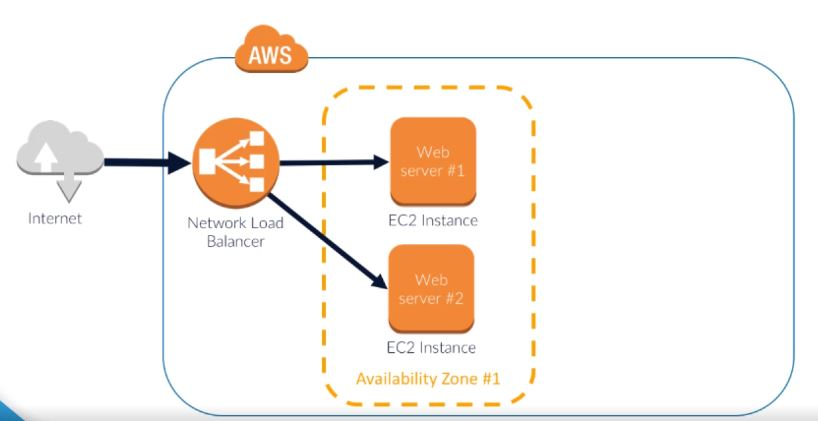
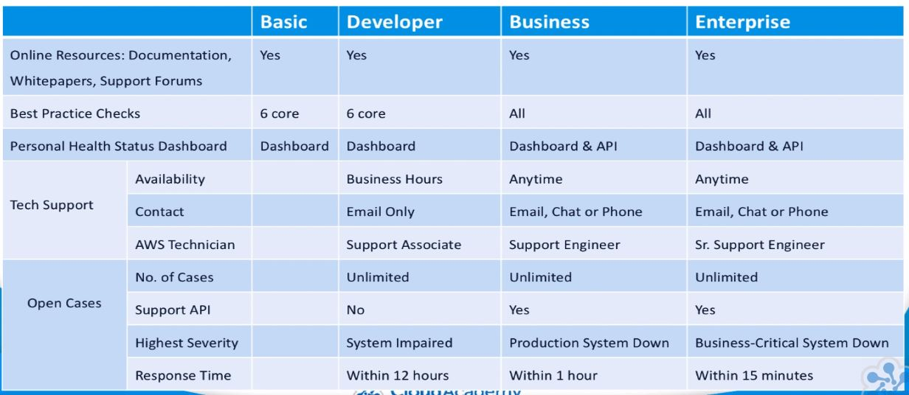

<!-- TOC depthFrom:2 depthTo:2 withLinks:1 updateOnSave:1 orderedList:0 -->

- [Intro](#intro)
- [What is Cloud Computing](#what-is-cloud-computing)
- [Compute Fundamentals](#compute-fundamentals)
- [Storage Fundamentals](#storage-fundamentals)
- [Networking Fundamentals](#networking-fundamentals)
- [Security Fundamentals](#security-fundamentals)
- [Management Fundamentals](#management-fundamentals)
- [Architecture Fundamentals](#architecture-fundamentals)
- [AWS Cost Management and Customer Support](#aws-cost-management-and-customer-support)
- [Cloud Practitioner Summary](#cloud-practitioner-summary)

<!-- /TOC -->

---
## Intro

**Domains**

1. Cloud Concepts
  - Define the AWS Cloud and its value proposition
  - Identify aspects of AWS cloud economics
  - List the different cloud architecture design principles
    - Understand general cloud concepts and principals.
    - Illustrate the benefits of the cloud and what it can bring to your business from both a financial and
    operational perspective.
2. Security
  - Define the AWS shared responsibility model
  - Define AWS cloud security and compliance concepts
  - Identify AWS access management capabilities
  - Identify resources for security support
    - Understanding of cloud security ensuring you understand the boundaries of where specific responsibilities lay
    between you and AWS. It will also access your knowledge of access control to your AWS resources and how you can
    maintain compliance within your environment and how to request additional support if required.
3. Technology
  - Define methods of deploying and operating in the AWS cloud
  - Define the AWS global infrastructure
  - Identify the core AWS services
  - Identify resources for technology support.
    - Knowledge of the core components of AWS, its global infrastructure and its key services across a spectrum of
    categories such as compute, storage, databases and networking.
4. Billing and Pricing
  - Compare and contrast the various pricing models for AWS
  - Recognize the various account structures in relation to AWS billing and pricing
  - Identify resources available for billing support.
    - Understand how to track and trace your cloud spend when using AWS using a variety of tool sets that are available.

---

### What is Cloud Computing

Cloud Computing is a remote virtual pool of on-demand shared resources offering Compute, Storage, Database and
Network services that can be rapidly deployed at scale.

*Virtualization*, in essence, allows a possibility of having multiple virtual machines, each running essentially
a separate operating system and applications installed on one physical server. These VMs all run at the same time
without being aware of each other's existence, while sharing the underlying hardware resources of the server.

A *hypervisor* is a piece of software used to create the virtualized environment, allowing for multiple VMs to be
installed on the same host. When installed, it sits between the physical hardware, and the virtual machines
themselves, and creates a shared pool of virtual hardware resources for each of them to access. All VMs installed
on the host see the hardware as they normally would. However, any request to the hardware goes via the hypervisor
which handles the access, ensuring the hardware resources are shared between all other VMs as needed.

Benefits of Virtualization
    - Reduced capex
    - Reduced op costs
    - Less space required
    - Optimization of resources

A *Virtual Machine* in the cloud is often referred to as an *instance*.

**Compute, Storage, Database and Network**

*Compute* resources are CPUs and Ram.

*Storage* resources allow you to save your data across a shared environment. Any object that allows you to save your
data in the cloud, is classed as a storage resource. In a typical environment, these would be seen as your server
hard discs, or your network attached storage, your NAS, which is used for file level shared storage access over the
network, and your high speed storage area network, your SAM, which is block level shared storage accessed over a
high speed network.

*Database* resources allow you to store structured datasets used by your applications.

*Network* resources provide the connectivity allowing all other resources; such as your compute, storage and database;
to communicate with each other.

### Cloud Deployment Models

- A **Public Cloud** model is where a vendor makes available the use of shared infrastructure, including compute storage
and network resources that can be provisioned on demand and typically accessed over the internet for public usage.
- A **Private Cloud** is different to a public cloud in that the infrastructure is privately hosted, managed and owned
by the individual company using it, giving it greater and more direct control of its data.
- A **Hybrid Model** is established when a network link is configured between the private cloud to the services within
the public cloud, essentially extending the logical internal network.

### Key Cloud Concepts

- **On-demand resourcing**
    - When you need to use it, it is available--hence, "on-demand".
- **Scalable**
    - Cloud computing allows for scaling resources, like compute and storage, as needed.
    - *in/out*
        - Scaling the power of your instance
    - *up/down*
        - Scaling the number of instances utilized.
- **Benefit from economy of scale**
    - Since the public cloud is shared so widely each user shares the reduced costs.
- **Flexibility and Elasticity**
    - This idea blends the on-demand and scalability concepts where you can adjust your
resources on the fly.
- **Growth**
    - Allows growth on-demand.
- **Utility based metering**
    - Only pay for what you use, like a utility.
- **Shared infrastructure**
- **Highly available**
    - Core services and infrastructure replicates across geographic zones.
- **Security**
    - Public cloud vendors such as Amazon Web Services (AWS) and Microsoft Azure, are considered to be more
    secure than your own data center.  The vendor operate to an exceptionally high standard of security for the underlying
    infrastructure of the cloud, and it's down to you, the end user, to then architect security in the cloud using the
    tools, service, and applications available.

### Cloud Service Models

- **Infrastructure as a Service (IaaS)**
    - Offers highest level of customization but host is still managed by the vendor.
    - This service allows you to architect your environment by configuring a virtual network which is segmented from
    other networks allowing you to deploy compute, storage and other network resources as you require.
    - Ability to configure the type of OS and applications that you need.
    - Allows you to take advantage of the cloud's automation, resiliency and other cloud infrastructure service features.
- **Platform as a Service (PaaS)**
    - Providers give a greater level of management and control to you as you have access to a framework from the
    operating system and upwards.
    - The underlying architecture of the host hardware network components and OS are typically managed by the vendor and
    taken care of from a maintenance and support perspective which makes this a great deployment service for developers.
    - Developers are then free to focus and concentrate on developing great new apps sitting on this platform.
- **Software as a Service (SaaS)**
    - Allows for delivery of an application that can be widely distributed as accessed.
    - Fully managed
    - Accessed over the internet
    - No requirements to install software
    - Simple in their design
    - Minimal customization available
        - Ex. Gmail
- **Anything as a Service (XaaS)**
    - Essentially anything as a service and includes Disaster Recovery as a Service, Communications as a Service,
    and Monitoring as a Service.
    - Will not be covered in this course.

### Common Use Cases

- **Traffic Bursting**
    - Scale network and compute resources during peak traffic season.
- **Backup and disaster recovery**
    - Back up data into *AWS Glacier*--a cheaper storage solution.
- **Web hosting**
    - Its ability to *load balance* across multiple servers and *scale automatically* as traffic increases and
    decreases with demand.
    - *Content Delivery Network (CDN)* is a set of systems which redirect traffic to the closest caching servers to
    expedite delivery resulting in reduced latency for users across the globe.
    - *Domain Name Services (DNS)* can help manage demand on your web servers by redirecting requests to a *load
    balancer* first, which will evenly distribute the requests to multiple web servers.
- **Testing and development**
    - Extra resources are needed for testing and development.  If you only have the resources for production then this
    portion is often done in the cloud.
- **Proof of concept**
    - The cloud allows you to implement a proof of concept design and helps you bring ideas to life at a fraction of the
    cost because of hosting costs and only paying for what you use.
- **Big data manipulation**
    - Maintaining and implementing compute resources to handle huge datasets can be expensive and complicated. By using
    the cloud, you have the ability to use only the resources you need to analyze data when you need to.
    - Some public cloud vendors offer *specialized managed Big Data services* which gives you managed resource
    infrastructure and framework to run your workloads on, in addition to allowing for scalability, scheduling,
    monitoring, etc. Having some of these elements managed by the vendor allows you to focus on the data
    processing and not worry about the maintenance of the underlying architecture.

### Data Center Architecture in Cloud

- **Location**
    - Cloud providers have data centers all over the world providing fast data transfer, high availability and
    resilience.
- **Physical Security**
    - It is the vendors responsibility to manage facility security operations to the correct certification.  
- **Mechanical and Electrical infrastructure**
    - Such as generators, uninterruptible power supplies (UPS), computer room air conditioning units for cooling, fire
    suppression, etc., are at the data center itself thus, again, the responsibility of the vendor.
- **Network Infrastructure**
    - There are options to create a virtual network, which can be segmented from others, allowing you to deploy compute,
    storage and other network resources as you require. These virtual networks are usually simple to set up, requiring
    just a few small details before it's created. Within AWS these are classed as virtual private clouds (VPCs), from
    here you can create different network segments, both public facing and private.
    - Routing and access controllers for security can also be configured dynamically for enhanced control.
    - Once you have created your logical virtual network, and of course, different geographic regions if desired, you
    can then provision your server instances within these subnets. So networking components such as switches, routers
    and even firewalls have been replaced with virtual networks and their configurable components.
    - The back end element of how these services work are again maintained and managed by the vendor, but architecting
    how your virtual network is created is your responsibility, and it's your responsibility to ensure it's secure and
    not left vulnerable to attacks.
- **Servers**
    - Providers offer servers that are specific to hosting databases, and others focused on the heavy processing power
    needed to analyze big data. Vendors are capable of replicating the functions that you use with your in-house data
    center, but with a lot more advantages.
- **Storage**
    - Essentially unlimited, hugely scalable and highly durable and, as with compute power, there are different storage
    services depending on what sort of data you're using, and where you intend to use it.

### Key Points

- Cloud computing is a *remote virtual pool of on-demand shared resources* offering Compute Storage and Network services
that can be rapidly deployed at scale.
- Cloud computing is based on *virtualized* technology.
- Typical cloud resources are *compute*, *storage*, and *network*.
- There are *public*, *private* and *hybrid* deployment models.
- The main concepts of cloud computing are *On Demand*, *Scalability*, *Economies of Scale*, *Flexibility*, *Growth*,
*Utility Based Metering*, *Shared Infrastructure*, *Highly Available*, and *Security being a shared responsibility*.
- There're three main cloud service models: Infrastructure as a Service (*IaaS*), Platform as a Service (*PaaS*), and
Software as a Service (*SaaS*).
- Some common use cases for cloud computing: *Migration of Production Services*, *Traffic Bursting*, *Backup and
Disaster Recovery*, *Web Hosting*, *Testing and Development*, *Proof of Concept* and *Big Data and Data Manipulation*.

---

## Compute Fundamentals

- Intro
- What is Compute?
- AWS Compute
    - EC2
    - Elastic Load Balancing/Auto Scaling
    - Elastic Beanstalk
    - Lambda
- Summary

### Intro

Foundation services that AWS is built upon:
1. Compute
2. Storage
3. Database
4. Network

### Course Summary

**What is Compute in AWS?**

- The brains and processing power required by applications and systems to carry out computational abilities via a
series of instructions (CPU and RAM)

**Elastic Cloud Compute**

- Components include Amazon Machine Images (AMIs), instance types, the instance purchasing options, tenancy, user data,
storage options, and security.

**Elastic Load Balancing and Auto Scaling**

- ELB evenly distributes traffic to EC2 instances which helps to maintain high availability and resiliency of your
environment.

- Auto scaling is a mechanism that automatically allows you to increase or decrease your resources (EC2 Instances) to
meet demand based off of custom defined metrics and thresholds.

**Setting up an ELB**

1. Define Load Balancer
2. Assign Security Groups
3. Configure Security Settings
4. Configure Health Checks
5. Add EC2 Instances
6. Add Tags

**Auto Scaling Advantages**

1. Automatically manage resources
2. providing a better experience for users
3. reduce cost as you won't use any resources unnecessarily

**Elastic Beanstalk**

- An AWS managed service that takes your uploaded web application code and automatically provisions and deploys the
required resources within AWS to make the web application operational.

**Elastic Beanstalk Architecture**

- Applications
    - A collection of different elements, such as environments, environment configurations, and application versions
- Application Versions
    - A specific reference to a section of deployable code.
    - The application version typically point to S3.
- Environment
    - An environment refers to an application version deployed on AWS resources.
- Environment Configuration
    - A collection of parameters that dictate the resources behavior within the environment.
- Configuration Template
    - A baseline for creating a new environment configuration.

**Elastic Beanstalk Workflow**

1. Create Application
2. Upload Version
    - This creates the environment configuration.
3. Launch Environment
    - The environment is then created by Elastic Beanstalk with the appropriate resources to run your code.
4. Manage Environment
    - If the management of your application has altered the environment configuration, then your environment will be
  automatically updated.

**AWS Lambda**

*AWS Lambda* is a service that lets you run your own code in response to events in a scalable and highly
available serverless environment.

- *Severless* means that you can run your code without provisioning and managing compute resources.
- AWS will start, scale, maintain and stop the required compute resources for your lambda function.
- It is only actually *serveless* from the users perspective as they do not need to worry about how the code gets run.

**Lambda Function Elements**

1. Required resources
    - The resources required to execute your code
    - Specify the amount of RAM required
2. Maximum execution timeout
    - The maximum amount of time the lambda function will run before terminated.
3. IAM Role
    - Grants AWS Lambda the appropriate permissions
4. Handler name
    - The method in your code where the function starts its execution.

**Lambda Function Configurations Steps**

1. Select a BluePrint
    - Preconfigured Lambda Functions
2. Configure triggers
3. Configure the function
    - upload code or edit in-line
    - Define required resources, maximum execution timeout, IAM Role and Handler Name.

### What is Compute

Put simply compute resources can be considered the brains and processing power required by applications and systems
to carry out computational abilities via a series of instructions (Ex. CPU and RAM).

Two main compute resources:
1. EC2 - Long term compute
2. Lambda - Short term compute

Features that control compute resources:
- Elastic Load Balancing
- Auto Scaling

Compute resources can be consumed differently
- Different quantities and durations
- Wide range of categories

### Elastic Compute Cloud (EC2)

- One of the most common services in AWS
- Allows deployment of virtual servers

**EC2 Elements**
1. Amazon Machine Images (AMIs)
2. Instance types
3. Instance Purchasing Options
4. Tenancy
5. User Data
6. Storage options
7. Security

**Amazon Machine Images (AMIs)**
- Templates of pre-configured EC2 instances.
- An AMI will include an operating system and applications along with any custom configuration.
- AMIs can be purchased from the AWS Marketplace. The AWS Marketplace is basically an online store that allows you to
purchase AMIs from trusted vendors like Cisco, Citrix, Alert Logic, etc. These vendor AMIs may have specific
applications and configurations already made, such as instances that are optimized with built-in security and
monitoring tools or contain database migration systems.
- Community AMIs also exist, which are a repository of AMIs that have been created and shared by other AWS members.

**Instance types**
- After an AMI is selected then an you must select an instance type.
- An instance type simply defines the size of the instance from a CPU, memory, storage, and networking perspective.
- The flexibility to select varied instance types allows for the selection of the appropriate size or power of the
virtual server needed for optimal performance.
- Different instance types are categorized in to *EC2 Family Types* with distinct performance benefits.
*EC2 Family Types*
- General purpose
    - Balance of CPU, memory and storage
    - Ideal for small and medium applications
- Compute Optimized
    - High performance processors
        - High performance front-end, web servers, science applications.
- GPU
    - Optimized for graphic intensive applications
- Memory Optimized
    - Used for large-scale, enterprise-class, in-memory applications.
    - Such as performing real-time processing of unstructured data or for in-memory databases.
- Storage Optimized
    - SSD backed instance storage for low latency and high input output performance.
    - Great for analytics workloads, and NoSQL databases, data file systems, and log processing applications.

**Instance Purchasing Options**

EC2 instances payment plans:
- On-demand instances
    - Can be launched at any time
    - Can be used as long as needed
    - Typically used for irregular uninterruptible workloads
    - Best fit for testing and development environments
- Reserved instances
    - Used for long-term predictable workloads
    - Purchase for a set period of time for a reduced cost
    - Cost reduction based on payment method
    - Payment Methods:
        1. All Upfront
        2. Partial Upfront
        3. No Upfront
- Spot instances
    - Bid for unused EC2 Compute resources
    - no guarantee of having the resource for a fixed period of time
    - Price fluctuations based on supply and demand
    - Possible to get large EC2 instances for a very low price
    - Useful for processing data that can be suddenly interrupted

**Tenancy**

Tenancy relates to the hosting of your EC2 instance.
- Shared
    - EC2 instances are launched on any available host with the required resources
    - The same host may be used by multiple customers
    - Security mechanisms prevent one EC2 instance accessing another on the same host
- Dedicated Instances
    - Instances hosted on hardware that no other customer can access
    - May be required to meet compliance
    - Dedicated instances incur additional charges
- Dedicated Hosts
    - Additional visibility and control of the physical host
    - Allows you to use the same host for a number of your instances
    - May be required to meet compliance

**Storage options**

1. Persistent Storage
      - EBS volumes are physically separated from the EC2 instance
      - EBS volumes are logically attached via the AWS network
      - You can disconnect an EBS volume form the EC2 instance maintaining the data
      - You can implement encryption and take backup snapshots of all data.
2. Ephemeral Storage
      - Instance store volumes are physically attached to the underlying host
      - When the instance is stopped or terminated, all saved data on disk is lost
      - If you reboot your data WILL remain in tact
      - Unable to detach instance store volumes form the instance

**Security**

Security Groups are virtual firewalls for instances:
1. Source and destination restriction
2. Inbound and outbound rules
3. Ports and protocols usage

**EC2 Dashboard Status Checks**

1. System Status Checks
      - Issues relating to underlying host
      - Loss of power, network connectivity, hardware and software on the host
      - Faulty components that are under AWS responsibility
      - Stop and restart the instance - don't reboot!
2. Instance Status Checks
      - Issues with the EC2 instance itself
      - Incorrect network configuration, corrupt files, exhausted memory, kernel
      - Requires the instance owner to trouble shoot and resolve the issue

### Elastic Load Balancing and Auto Scaling

#### Elastic Load Balancing (ELB)

The main function of ELB is to evenly distribute traffic to your EC2 instances, which helps maintain high
availability and resilience of your environment.

**Network Load Balancer**
- Used for ultra-high performance for your application.
- Operates at the connections (transport) level.
- Capable of handling millions of requests per second.

**Application Load Balancer**
- Provides a flexible feature set for your web application with HTTP and HTTPS traffic.
- Operates at the request (application) level.
- Provides advances routing, TLS termination and visibility features.

**Classic Load Balancer**
- Used when you have an existing application running in the EC2-Classic environment.
- Operates at the connection (transport) and request (application) level.

**Elastic Load Balancing**

**Elastic Load Balancing Across Availability Groups**

**Setting up an ELB**
1. Define Load Balancer
2. Assign Security Groups
3. Configure Security Settings
4. Configure Health Checks
5. Add EC2 Instances
6. Add Tags

**Defining Load Balancer**
- You must choose either an *internal* or *external* load balancer.

An *external load balancer* will have a public IP address and will typically sit in front of your web servers,
receiving traffic from the internet, and then distribute those requests to your fleet of web servers.

An *internal load balancer* will have an internal IP address and can only be accessed from within your private
network. In this diagram, we have an internal ELB between the web servers and the two databases. The web server will
send data to the databases via the internal ELB. This will then **manage the traffic to the database layer**.

**Select Availability Zones**

Once the load balancer is selected, you can select the availability zones.
- It is best practice to have at least two availability zones in case AWS has an AZ outage.
- You must ensure that the (EC2) instances that you want to balance exist in these zones.

**ELB Listener Configuration**

- The listener enables ELB to check for connections requests
- Supported protocols: HTTP, HTTPS, TCP & SSL
- Typically external ELB have a listener configuration with HTTPS for additional security

**Assign Security Group**

Security groups are used the same way as in EC2 instances.

Security Groups are virtual firewalls for instances:
1. Source and destination restriction
2. Inbound and outbound rules
3. Ports and protocols usage

**Configure Security Settings**

- If you select HTTPS or SSL in the listener configuration for an external load balancer, you must deploy an SSL
certificate.  (This is discussed in a later course)

**Configure Health Check**

Monitors the health of an instance associated to the ELB.
- This health check monitors the health of any instance associated with the ELB to ensure that it is only routing
requests to instances that are functioning correctly. If a health check fails for an instance, then that instance is
automatically removed from the ELB. The health check is carried out by performing a ping using a specified protocol to
the instance.

**Add EC2 Instances**

Once health checks are configured, you must select the EC2 instances to be associated to the ELB.

**Add Tags**

Tags are key-value pairs used to add metadata to your resources.

#### Auto Scaling

- Through defined metrics you can increase or decrease the size of your EC2 fleet.
- This will automatically manage resources, providing a better experience for users, and reduce cost as you won't use
any resources unnecessarily.
- Auto scaling is a mechanism that automatically allows you to increase or decrease your resources to meet demand
based off of custom-defined metrics and thresholds.
- For example, let's say you had one EC2 instance acting as a web server. When the average CPU reaches 75%
utilization, you want to automatically deploy another EC2 instance to enable you to distribute traffic between the
two servers, bringing the average CPU percentage down. Therefore load balancing the traffic evenly and reducing the
chance of one web server failing or slowing down due to the high CPU usage. Similarly, when the average CPU usage
reduces to 20%, then you automatically want an EC2 instance to be terminated as the demand has dropped.

High CPU Usage:

Balanced CPU Usage:

**Combining ELB and Auto Scaling**

When ELB and Auto Scaling are combined we get a real scalable and flexible architecture.

Once you have your auto scaling group configured, you can attach your ELB to the group. When done so, your ELB will
automatically add any EC2 instances to the ELB as the group grows in size. Likewise, they would also be removed from
the ELB when the group scales back in again. Let's take a look at how auto scaling is configured.

**Auto Scaling Configuration**

1. Launch Configuration
    - Template that the Auto Scaling Group uses to launch new instances.
    - Select an AMI, instance type, IP addresses, storage volumes, user data requirements, storage volumes
    configuration, security groups, etc.
    - Similar steps as to when creating an EC2 instance.
2. Auto Scaling Group
    - Defines the desired capacity of the group using policies
    - Defines where the group should place resources.

### AWS Elastic Beanstalk

AWS Elastic Beanstalk is an AWS managed service that will take your uploaded web application code and automatically
provision, deploy, the appropriate and necessary resources within AWS to make the web application operational.

AWS Elastic Beanstalk is an AWS managed service that helps with deployment of web applications.

AWS Beanstalk provisions and deploys appropriate resources to your web applications, such as:
- EC2
- ELB
- Auto Scaling
- Application health monitoring

It is for engineers who do not have the skills with AWS needed to deploy, monitor, and scale the correct environment
themselves to run their developed applications. AWS Elastic Beanstalk automates the deployment of the correct
infrastructure to run the uploaded code--providing a simple, effective, and quick solution to the application
deployment rollout.

Elastic Beanstalk is free, however, any resources that are created on your application's behalf, such as EC2
instances, you will be charged for.

**Elastic Beanstalk Architecture**

- Applications
  - A collection of different elements, such as environments, environment configurations, and application versions
- Application Versions
  - A specific reference to a section of deployable code.
  - The application version typically point to S3.
- Environment
  - An environment refers to an application version deployed on AWS resources.
- Environment Configuration
  - A collection of parameters that dictate the resources behavior within the environment.
- Configuration Template
  - A baseline for creating a new environment configuration.

**AWS Elastic Beanstalk Workflow**

1. Create Application
2. Upload Version
    - This creates the environment configuration.
3. Launch Environment
    - The environment is then created by Elastic Beanstalk with the appropriate resources to run your code.
4. Manage Environment
    - If the management of your application has altered the environment configuration, then your environment will be
    automatically updated.

### AWS Lambda

AWS Lambda is a service that lets you run your own code in response to events in a scalable and highly
available serverless environment.

**Serveless Computing**

- *Severless* means that you can run your code without provisioning and managing compute resources.
- AWS will start, scale, maintain and stop the required compute resources for your lambda function.
- It is only actually *serverless* from the users perspective as they do not need to worry about how the code gets run.

**Use Cases**

AWS Lambda executes code in response to event triggers.
- Create applications that will respond quickly to new information.
- Automating processes in existing, applications and services.
- Supported languages: Node.js, Java, C#, and Python.

**Compute Power**

- EC2 charges for compute time per hour or second (AMI dependent)
- AWS Lambda charges for compute time use to the closest 100ms.

**Lambda Functions**

A Lambda function contains your code that performs a required task, plus any dependencies for that code:
1. Required resources
    - The resources required to execute your code
    - Specify the amount of RAM required
2. Maximum execution timeout
    - The maximum amount of time the lambda function will run before terminated.
3. IAM Role
    - Grants AWS Lambda the appropriate permissions
4. Handler name
    - The method in your code where the function starts its execution.

**Triggers**

When creating a Lambda function, you must define the trigger before creating your code for the function. These
triggers, or event resources, can be via another AWS service such as S3, DynamoDB, CloudFront, or by invoking the
function on demand.

**Configurations Steps**

1. Select a BluePrint
    - Preconfigured Lambda Functions
2. Configure triggers
3. Configure the function
    - upload code or edit in-line
    - Define required resources, maximum execution timeout, IAM Role and Handler Name.

The key benefit of using AWS Lambda is that it is a highly scalable serverless service, coupled with fantastic cost
optimization compared to EC2 as you are only charged for compute power whilst the code is running and for the number
of functions called.

---

## Storage Fundamentals

- AWS Storage
    - S3
    - Glacier
    - EBS
    - Elastic File System
    - RDS
    - Other database services
    - CloudFront
- AWS Data Services
    - AWS Storage Gateway
    - AWS Snowball
- Summary

### AWS Storage

#### Amazon Simple Storage S3

**References**
- [Amazon S3 Pricing Page](https://aws.amazon.com/s3/pricing/)

**Amazon S3**

- A fully managed object based storage service.
- Highly available
- Highly durable
- Very cost effective
- Widely and easily accessible
- Unlimited storage capacity
- Smallest file size supported = 0 bytes
- Largest file size supported = 5 terabytes

**Regional Based**

When uploading data to S3 you are required to specify the regional location for that data to be placed in. Amazon S3
will then store and duplicate your uploaded data multiple times across multiple available zones within that region to
increase both its durability and availability.

**Durability and Availability**

- Objects stored in S3 have a durability of 99.999999999%
- S3 stores numerous copies of the same data in different AZ's
- The availability of the S3 data object is 99.99%

*Availability* - S3 up-time (i.e. how much of the time you will have access to your data).

*Durability* - The probability of not losing your data

**S3 Buckets**
- Objects are stored in S3 buckets--which are like parent directories
- Bucket names mush be globally unique
- Data can be uploaded into the bucket or folders within
- Limitation of 100 buckets per AWS account
- Objects have a unique object key identifying that object
- S3 is not a file system so some features only work at the bucket level--not folder level

**Storage Classes**
- Standard
- Standard - IA (Infrequent Access)
- Reduced Redundancy

**Security**
- Bucket Policies
    - Impose set access controls within specific bucket
    - Constructed as JSON policies
    - Only control access to data in the associated bucket
    - Permissions can be very specific using policy conditions
    - Provide added granularity to buckets access
- Access Control Lists (ACLs)
    - ACLs only control access for users outside of your own AWS account, such as public access
    - ACLs are not as granular as bucket policies
    - The permissions are broad in access, for example 'LIst objects' and 'Write objects'
- Data Encryption
    - Server-side (SSE) and client-side (CSE) encryption methods
    - SSE-S3 (S3 managed keys)
    - SSE-KMS (KMS managed keys)
    - SSE-C (Customer managed keys)
    - CSE-KMS (KMS managed keys)
    - CSE-C (Customer managed keys)
    - SSL is supported (Secure Socket Layer)

- The main difference between client-side and server-side encryption is the location at which the encryption takes
place. Server-side encryption takes place within a AWS S3 and client side encryption occurs on your client prior to
uploading your objects.

**Data Management**

- Versioning
    - Allows for multiple versions of the same object to exist
    - Useful to recover from accidental deletion, or malicious activity
    - Only the latest version of the object is displayed by default
    - Versioning is not enables by default
    - You can't disable versioning, only suspend it
    - Adds cost for storing multiple versions of the same object

- Lifecycle Rules
    - Provides an automatic method of managing the lifecycle of your data stored
    - Ability to configure specific criteria to automatically move data between storage classes, including Glacier
    or even deleting data completely
    - The time frame is configurable, allowing you to set it for your own requirements

**Common Uses**
- Data Backup
- Static Content & Websites
- Large Datasets
- Integration with other AWS Services
  - Elastic Block Store
  - AWS CloudTrail
  - Amazon CloudFront

**Drawbacks**
- Data archiving for long term use
- Dynamic and fast changing data
- File system requirements
- Structured data with queries

#### Amazon Glacier

- A very low cost, long term, durable storage solution (cold storage) suited for long term backup and archival requirements.
- It does not provide instant access to your data.
- Attains 99.999999999% durability by replicating data across multiple availability zones within a single region.
- Storage costs are considerably lower than S3.
- Retrieval of your data can take several hours.

**Vaults and Archives**

- Vaults act as containers for Glacier Archives
- Vaults are regional
- Within each vault you can store data as archives
- Archives can be any object similar to S3
- You can have unlimited archives within you Glacier Vaults

**Glacier Dashboard**

- The Glacier dashboard only allows you to create vaults
- Any operational process to upload or retrieve data HAS to be done using code:
  - [The Glacier web service API](https://docs.aws.amazon.com/amazonglacier/latest/dev/amazon-glacier-api.html)
  - [AWS SDKs](https://docs.aws.amazon.com/amazonglacier/latest/dev/using-aws-sdk.html)

**Moving Data into Glacier**

1. Create your vaults
2. Move data into Glacier using the API/SDK or S3 Lifecycle rules

**Data Retrieval**

1. Expedited
    - Used for urgent access to a subset of an Archive
    - Less than 250MB
    - Data available within 1 - 5 mins
    - Cost: $0.03/GB and $0.01/request
2. Standard
    - Used to retrieve and of your Archives, regardless of size
    - Data available within 3 - 5 hours
    - Cost: $0.01.GB and $0.05/1,000 requests
3. Bulk
    - Used to retrieve petabytes of data
    - Data available within 5 - 12 hours
    - The cheapest option for data retrieval
    - Cost: $0.0025/GB and $0.025/1,000 requests.

**Security**

By default Glacier encrypts data using AES-256 encryption algorithm

Addition methods of access control:
- Vault access policies
- Resource based policies
- Applied to a specific vault
- Each vault can only contain 1 vault access policy
- Policy is in JSON format
- Policy contains a *principal* component

Vault Lock Policies:
- Once set they cannot be changed
- Used to help maintain specific governance & compliance

You would use *Vault Access Policies* to govern access control features that may change over time and you would use
*Vault Lock Policies* to help you maintain compliance using access controls that must not be changed.

#### Amazon Elastic Block Store EBS

- Provides Block level storage to EC2 instances
- Offers persistent and durable data storage
- Greater flexibility than that of instance store volumes
- EBS volumes can be attached to EC2 instances for rapidly changing data
- Used to retain valuable data due to it's persistent qualities
- Operates as a separate service to EC2
- EBS volumes act as network attached storage devices
- Each volume can only be attached to one EC2 instance
- Multiple EBS volumes can be attached to a single EC2 instance
- Data is retained if the EC2 instance is stopped, restarted or terminated

**EBS Snapshots**

EBS offers the ability to provide point in time backup snapshots of the entire volume as and when you need to.
You can manually create a snapshot of your volume at any time, or some code to perform this automatically on
a scheduled basis. Snapshots are stored in S3 and can always be duplicated or recreated.

**High Availability**

Every EBS volume is replicated multiple times within the same availability zone of your region to help prevent
the complete loss of data. This means that your EBS volume itself is only available in a single availability zone.

As a result, should your availability zone fail, you will lose access to your EBS volume. Should this occur, you
can simply recreate the volume from your previous snapshot, which is accessible from all availability zones within
that region, and attach it to another instance in another availability zone.

**EBS Volume Types**

SSD (Solid State Drives)
- Suited for work with smaller blocks of data
- Databases using transactional workloads
- Often used for boot volumes on EC2 instances
- Types:
    - General Purpose SSD (GP2)
    - Provisioned IOPS (IO1)

HDD (Hard Disk Drives)
- Designed for workloads requiring a high rate of throughput (MB/s)
- Big data processing & logging information
- Larger blocks of data
- Types:
    - Cold HDD (SC1)
    - Throughput Optimized HDD (ST1)

Volume Type Details:
- General Purpose SSD (GP2)
    - Provides single digit millisecond latency
    - Can burst up to 3,000 IOPS
    - A baseline performance of 3 IOPS up to 10,000 IOPS
    - Throughput of 128 MB/s for volumes up to 170GB
    - Throughput increases to 768 KB/s per GB up to the maximum of 160 MB/s (214+ GB volumes)
- Provisioned IOPS (IO1)
    - Delivers predictable performance for I/O intensive workloads
    - Specify IOPS rate during the creation of new RBS volume
    - Volumes attached to EBS optimized instances, will deliver the IOPS defined within 10%, 99.9% of the time
    - Volumes range from 4 - 16 TB
    - The maximum IOPS possible is set to 20,000
- Cold HDD (SC1)
    - Offers the lowest cost compared to other volume types
    - Designed for large workloads accesses infrequently
    - High throughput capabilities (MB/s)
    - Can burst to 80 MB/s per TB
    - Delivers 99% of expected throughput
    - Can't use as boot volume for instances
- Throughput Optimized HDD (ST1)
    - Designed for frequently accessed data
    - Suited to work with large data sets requiring throughput-intensive workloads
    - Ability to burst up to 250 MB/s
    - Maximum burst 500 MB/s per volume
    - Delivers 99% of the expected throughput

**Encryption**

- EBS offers encryption at rest and in transit
- Encryption is managed by the EBS service itself
- It can be enabled with a checkbox

[Blog: How to encrypt an EBS Volume](https://cloudacademy.com/blog/how-to-encrypt-an-ebs-volume-the-new-amazon-ebs-encryption/)

**Creating a new EBS Volume**

There are 2 ways of creating a new EBS volume from within the Management Console
1. During the creation of a new EC2 instance
2. As a stand alone EBS Volume

**Changing the size of an EBS Volume**

- EBS Volumes are elastically scalable
- Increase the volume size via AWS Management Console

**Drawbacks**

- Temporary storage
- Multi-instance storage access
- Very high durability and availability

#### Amazon Elastic File System

- EFS provides a file level storage service
- EFS is fully managed
- Highly available & durable
- Ability to create shared file systems
- Highly scalable
- Concurrent access by 1,000's of instances
- Limitless capacity (storage elastically grows)
- regional, spanning multiple availability zones

**Creating an Elastic File System**

- Created in management console

From within the EFS dashboard, you select to create a new file system, and then you are required to enter some
configuration information. You must select which VPC that this file system will exist in, and once selected, EFS
will automatically create mount targets for you, across the availability zones where you have EC2 instances. These
mount targets allow you to connect to the EFS file system, from your EC2 instances, using a configured mount target IP
address.

When mounting the EFS file system, be aware that it is only compatible with NFS version 4, and 4.1. With this
in mind, EFS does not currently support the Windows operating system. You must insure that your Linus EC2 instance has
the NFS client installed for the mounting process, and the NFS client version 4.1 is recommended for this procedure.
For each mount point, you are able to select which subnet the mount point exists in, as well as defining your security
group to control access from what instance level.

The next step of creating your file system involves defining your tags, performance mode, and encryption settings.
The two different performance modes of operations are general purpose and Max I/O. For most use cases and requirements,
you will likely be using general purpose. It has the lowest latency out of the two different modes, and will work with
many different application workloads. There is a limitation of this mode, allowing only up to 7,000 file system
operations per second to your EFS file system. If, however, you have huge scale architectures, or your EFS file
system is likely to be used by many thousands of EC2 instances concurrently, and will exceed 7,000 operations per
second, then you will need to consider Max I/O. This also offers a virtually unlimited amount of throughput and IOPS,
in addition to additional latency to each I/O.

The best way to understand which performance option you need is to run tests alongside your application. If your
application sits comfortably within the upper limit of the 7,000 operations per second, then general purpose will
be best suited, with the added plus point of the lower latency. However, if your testing confirms 7,000 operations
per second may be tight, then select Max I/O. When using the general purpose mode of operations, EFS provides a
CloudWatch metric, PercentIOLimit, which allows you to view your operations per second as a percentage of the top
7,000 limit. This allows you to make the decision to migrate and move to the Max I/O file system, should your
operations be reaching the limit.

You also have the opportunity to implement encryption of your EFS, using a simple checkbox, and selecting
your desired CMK. Much like EBS, EFS uses the services offered by the key management service, to provide encryption
of crucial storage. However, at this stage, encryption is only offered at rest, and not in transit. The final stage
requires you to review and create your EFS file system, based on the configuration that you have specified.

Once your file system is created, you are presented with your mount target points, allowing you to connect your
EC2 instances as required. In addition to having the ability of being able to mount the new EFS file system to your
EC2 instances in your VPC, you can always use these mount points on your on-premise service, as long as you connect
via direct connect, or 3rd party VPN.

**Moving Data to EFS**

If you have existing data, either on your own service in your own on-premises data center, or data that already
exists in AWS, such as on EC2 instances and you want to move that data into EFS, then you can use the file sync
feature. File sync can be configured from within the EFS dashboard of the management console, and it allows you
to securely manage the transfer of files between an existing storage location, and your EFS file system via a file
sync agent.

**File Sync**

If you require the need to sync source files from your on-premises environment, then you can download
the file sync agent as a VMware ESXi host. If you are syncing source files from within AWS, then it will provide a
community-based AMI, to be used with an EC2 instance. This agent is then configured with your source destination
amount target of your EFS file system details, and logically sits in between them. From within the EFS dashboard,
you can then start the file sync, and monitor it's progress with Amazon CloudWatch.

**Drawbacks**
- Data Archiving
- Relational Databases
- Temporary Storage

#### Amazon RDS

AWS Relational Database Service (RDS) is a managed database service that lets you focus on building your application
storage by taking away the administrative components, such up backups, patches, and replication. It supports a variety
of different relational database builders (such as: Amazon Aurora, PostgreSQL, MySQL, MariaDB, Oracle and SQLServer)
and it offers a reliable infrastructure for running your own database in multiple availability zones.

**Availability and Durability**

- Automatic Backups
- Database Snapshots
- Multi-AZ Deployments
- Automatic Host Replacement

**Other benefits**

- Encryption
    - AWS KMS
    - Amazon cloudHSM
- Resource level permissions

**Maintenance Window**

- Maintenance Window
    - RDS performs maintenance on RDS resources for you
- Multi-AZ Maintenance
    - Amazon RDS will conduct maintenance by following these steps:
        - Perform maintenance on the standby
        - Promote the standby to primary
        - Perform maintenance on the old primary, which becomes the new standby

**RDS - Best Practices**

1. Monitor your memory, CPU and storage usage with *Amazon CloudWatch notifications*.
2. Scale up your DB instance when you are approaching storage capacity limits.
3. Enable Automatic backups and set the backup window to occur during the daily low in WriteIOPS.
4. On a MySQL DB instance, do not create more than 10,000 tables using Provisioned IOPS or 1,000 tables using
standard storage.
5. On a MySQL DB instance, avoid tables in your database growing too large.
    - Partition tables so file size stays under 2 TB limit.

**RDS - Security**

1. Amazon RDS DB Instance access is controlled via *Database Security Groups*.
2. RDS Database Security Groups are not interchangeable with EC2 Security groups.
3. Database Security Groups default to "deny all" access.
4. Database Security groups only allow access to the database server port.
5. Amazon RDS generates an SSL certificate for each DB instance, allowing customers to encrypt their DB Instance
connections for enhanced security.
6. Once an Amazon RDS Db Instance deletion API (DeleteDBInstance) is run, the DB Instance is marked for deletion
and once the instance no longer indicates 'deleting' status, it has been removed.

**RDS - Security Best Practices**

1. Do not use AWS root credentials to manage Amazon RDS resources.
2. Use AWS IAM accounts to control access to Amazon RDS API actions.
3. Assign an individual IAM account to each person who manages RDS resources.
4. Grant each user the minimum set of permissions required to perform his or her duties.
5. Use IAM groups to effectively manage permissions for multiple users.
6. Rotate your IAM credential regularly.

#### Other Database Services

- **Dynamo DB**
    - NoSQL key-value data store
    - Table scanning is made possible using secondary indexes based on your application search parameters.
    - You can update streams which allow you to hook them into item label changes.
    - Consider Dynamo DB when your application model is schemaless and nonrelational.
    - Can also serve as a persistent session storage mechanism for applications to decouple applications and take away
    service state.
- **Elasticache**
    - Managed in-memory cache service for fast, reliable data access.
    - Underlying engines behind ElastiCache are **Memcached** and **Redis**.
        - With the Redis engine you can take advantage of multiple availability zones for high availability and scaling to read replicas.
    - ElastiCache will automatically detect failed nodes and replace them without manual intervention.
    - A typical use case for ElastiCache is low latency access of frequently retrieved data.
        - Think cache database results of data within frequent changes for use in a heavily utilized web application.
    - It can serve as temporary storage for compute-intensive workloads or when storing the results from IO intense queries or calculations.
- **RedShift**
    - A fully managed petabyte-scale data warehouse optimized for fast delivery performance with large data sets.
        - So if you're using HSMs, CloudHSM, and AWS management services, you can encrypt your data at rest.
    - Fully compliant with a variety of compliance standards, including SOC 1, SOC 2, SOC 3, and PCI DSS Level 1.
    - Can query your data using standard SQL commands through ODBC or JDBC connections.
    - Integrates with other services, including AWS data pipeline and Kinesis.
    - Used to archive large amounts of infrequently used data.
    - Good for executing analytical queries on large data sets.
    - Also an ideal use case for Elastic Map Reduce jobs that convert unstructured data into structured data.
- **Elastic Map Reduce (EMR)**
    - A Managed Hadoop framework designed for quickly processing large amounts of data in a really cost-effective way.
    - It can dynamically scale across EC2 instances based on how much you want to spend.
    - Offers self-healing and fault tolerant processing of your data.
    - A common use case for using EMR is to process user behavior data that you might have collected from multiple sources.
    - if you're already using Hadoop on premise, then migrating to EMR can offer improved cost and processing with less
    administration.
    -  Every request made to the EMR API is authenticated, so only authenticated users can create look up or terminate
    different job flows.
    - When launching customer job flows, Amazon EMR sits up on Amazon EC2 security group, off the Master Node to only
    allow external access via SSH.
    - To protect customer input and output data sets, Amazon EMR transfers data to and from S3 using SSL.
- **Kinesis**
    - A fully managed service for processing real-time data streams.
    - Can capture terabytes of data, per hour, from over 100,000 different sources.
    - Output from Kinesis can be saved to storage such as S3, DynamoDB or RedShift, or ported to services such as EMR or
    Lambda among others.
    - There's a Kinesis Client Library (KCL) that can be used for integration with your other applications.
        - The KCL helps you consume and process data from an Amazon Kinesis stream.
        - The KCL acts as an intermediary between your record processing logic and Streams.
        - When you start a KCL application, it calls the KCL to instantiate a worker. This call provides the KCL with
        configuration information for the application, such as the stream name and AWS credentials.
        - The KCL is different from the Streams API which you get in the AWS SDKs. The Streams API helps you manage
        Streams (including creating streams, resharding, and putting and getting records), while the KCL provides a layer
        of abstraction specifically for processing data in a consumer role.
    - If you need a dashboard that shows updates in real time, Kinesis is a perfect solution since you can combine data
    sources from all over including social media.

#### Amazon Cloud Front

**Amazon CloudFront**

- A Content Delivery Network Service.
- Distributes data requested through web traffic closer to the end user via edge locations.
- Data is cached temporarily, so durability does not come from here.
- Origin data can come from Amazon S3, durability of data is guaranteed here.

**Edge Locations**

- AWS edge locations are sites deployed in highly populated areas across the globe.
- Edge locations are not used to deploy infrastructure (EC2/EBS/etc.)
- Edge locations allow the ability to cache data and reduce latency for end user access with services such as Amazon
 CloudFront.

**Distributions**

1. Web Distribution
    - Used to distribute both static and dynamic content.
    - Uses both HTTP and HTTPS protocol.
    - Allows you to add, remove and update objects.
    - Ability to provide live stream functionality on your website.
    - Uses an 'origin' to define where the source data is coming from.
    - Origins can be a web server, EC2 instance or an S3 bucket.
2. RTMP Distribution
    - Real-Time Messaging Protocol
    - Should be used if your focus is to distribute streaming media using Adobe Flash media server's RTMP protocol.
    - Allows the end user to start viewing media before the complete file has been downloaded from the edge location.
    - The source data can only exist within an S3 bucket.

**Distribution Configurations**

- You must specify your origin location
- Select specific caching behavioral options
- Define the distribution settings (which edge locations you want your data to be distributed to)

**CloudFront & WAF**

- Web Application Firewall (WAF)
- WAF provides additional security for your web application tier
- Encryption can be applied through SSL certificates

**High Level Process**

- When content from your website is accessed, the end user will be directed to their closest edge location in terms of
latency, to see if the content is cached by CloudFront at that edge location.
- If the content is there, the user will access the content from the edge location instead of the origin, therefore
reducing latency.
- If the content is not there, or the cache has expired for that content at the edge location, then CloudFront will
request the content from the source origin again. This content will then be used to maintain a fresh cache for any
future request until it again expires.

### AWS Data Services

#### AWS Storage Gateway

**Storage Gateway** allows you to provide a gateway between your own data center's storage systems, such as your
SAN, NAS, or DAS, and Amazon S3 in Glacier on AWS.

The storage gateway itself is a software appliance that can be installed within your own data center, which allows
integration between your on-premise storage and AWS. This connectivity can allow you to scale your storage requirements
both securely and cost efficiently.

The software appliance can be downloaded from AWS as a virtual machine.

3 configurations available:
1. File Gateway
2. Volume Gateway
3. Tape Gateway

**File Gateway**

- Allows you to securely store your files as objects in S3
- Ability to mount or map drives to an S3 bucket as if it was a share held locally

When storing files using the file gateway, they are sent to S3 over HTTPS, and are also encrypted with S3's own
server-side encryption, SSE-S3. In addition to this, a local on-premise cache is also provisioned for accessing your
most recently accessed files to optimize latency, which also helps to reduce egress traffic costs. When your file
gateway is first configured, you must associate it with your S3 Bucket which the gateway will then present as an
NFS v3 or v41 file system to your internal applications. This allows you to view the Bucket as a normal NFS file system,
making it easier to mount as a drive in Linux or map a drive to it in Microsoft. Any files that are then written to
these NFS file systems are stored in S3 as individual objects as a one to one mapping of files to objects.

**Volume Gateways**

Can be configured in 2 ways:
1. Stored Volume Gateways
2. Cached Volume Gateways

**Stored Volume Gateways**

- Used to backup your local storage volumes to Amazon S3
- Your entire local data set remains on-premise ensuring low latency data access

Volumes created and configured within the storage gateway are backed by Amazon S3, and are mounted as iSCSI devices
that your applications can then communicate with. During the volume creation, these are mapped to your on premise
storage devices, which can either hold existent data or be a new disk. As data is written to these iSCSI devices, the
data is actually written to your local storage services such as your own NAS, SAN, or DAS storage solution. However,
the storage gateway then asynchronously copies this data to Amazon S3 as EBS snapshots. Having your entire data set
remain locally ensures you have the lowest latency possible to access your data, which may be required for specific
applications, or security compliance and governance controls whilst at the same time, providing a backup solution
which is governed by the same controls and security that S3 offers.

- Volumes can be between one gig and 16 terabytes
- Each storage gateway, up to 32 stored volumes
- Maximum total of 512 terabytes of storage per gateway
- A storage buffer using on-premise storage is used as a staging point for data that is waiting to be written to S3
- Data is uploaded across an SSL channel and stored in an encrypted format in S3
- Snapshots can be taken of volumes at any point an stored as EBS snapshots in S3
  - These snapshots are incremental ensuring that only the data that's changed since the last backup is copied,
  helping to minimize storage costs in S3

As you can see, gateway stored volumes makes recovering from a disaster very simple. For example, consider the
scenario that you lost your local application and storage layers on premise. Providing you had prevision for such a
situation, you may have AMI templates that mimic your application tier which you could prevision as EC2 instances
within AWS. You could then attach EBS volumes to these instances which could be created from your storage gateway
volume snapshots, which would be stored on S3, giving you access to your production data required. Your application
storage infrastructure could be potentially up and running again in a matter of minutes within a VPC with connectivity
from your on-premise data center.

**Cached Volume Gateways**

Cached volume gateways are different to stored volume gateways, in that:
- The primary data storage is actually Amazon S3 (rather than your own local storage solution).
- However, cached volume gateways do utilize your local data storage as a buffer and a cache for recently accessed
data to help maintain low latency, hence the name cached volumes.

Again, during the creation of these volumes, they are presented as iSCSI volumes which can be mounted by your application
servers. The volumes themselves are backed by the Amazon S3 infrastructure as opposed to your local disks as seen in
the stored volume gateway deployment. As a part of this volume creation, you must also select some local disks
on-premise to act as your local cache and a buffer for data waiting to be uploaded to S3. Again, this buffer is used
as a staging point for data that is waiting to be written to S3 and during the upload process the data is encrypted
using an SSL channel, where the data is then encrypted within SSE-S3.

The limitations is slightly different with cached volume gateways, in that:
- each volume created can be up to 32 terabytes in size.
- support for up to 32 volumes
- total storage capacity of 1024 terabytes per cache volume gateway.
- still possible to take incremental backups with these volumes as EBS snapshots.

**Tape Gateway**

AKA Gateway VTL, Virtual Tape Library.

This allows you to, again,
- backup your data to S3 from your own corporate data center,
- but also leverage *Amazon Glacier* for data archiving.

VTL is essentially a cloud based tape backup solution, replacing physical components with virtual ones. This
functionality allows you to use your existing tape backup application infrastructure within AWS, providing a more
robust and secure backup and archiving solution.

VTL Elements:

- Storage gateway.
    - The gateway itself is configured as a tape gateway, which has a capacity to hold 1500 virtual tapes.
- Virtual tapes.
    - These are a virtual equivalent to a physical backup tape cartridge which can be anything from 100 gig to 2.5
    terabytes in size, and any data stored on the virtual tapes are backed by AWS S3 and appear in the virtual tape
    library.
- Virtual tape library, VTL.
    - As you may have guessed, these are a virtual equivalent to a tape library that contain virtual tapes.
- Tape drives.
  - Every VTL comes with 10 virtual tape drives, which are presented to your backup applications as iSCSI devices.
- Media changer.
    - This is a virtual device that manages tapes to and from the tape drive to your VTL, and again is presented as an
    iSCSI device to your backup applications.
- Archive.
    - This is equivalent to an off-site tape backup storage facility where you can archive tapes from your virtual
    tape library to Amazon Glacier, which as we already know is used as a cold storage solution. If retrieval of the
    tapes are required, storage gateway uses the standard retrieval option which can take between three to five hours
    to retrieve your data.

Once your storage gateway has been configured as a tape gateway:
- your applications and backup software can mount the tape drives along with the media changer as iSCSI devices to
make the connection.
- You can then create the required virtual tapes as you need them for backup and your backup software can use these
to backup the required data which is stored on S3.
- Archiving tapes moves data from S3 to Glacier.

#### AWS Snowball

**AWS Snowball**
- A physical device shipped from AWS to help with large scale data transfers.
- The devices are literally loaded up with your data (or you load it up if getting data to S3) and shipped to you so
that you can then take the data from them to your data center.
- Used to securely transfer large amounts of data in and out of AWS (Petabyte Scale)
- Either from your on-premise data center to S3, or form S3 to your data center.
- The snowball appliance comes as either a 50 TB or 80 TB device.
- The snowball appliance is dust, water and tamper resistant.
- Built for high speed data transfer:
    - RJ45 (Cat6)
    - SFP+ Copper
    - SFP+ Optical

**Encryption and Tracking**

- By default, all data transferred to a snowball appliance is automatically encrypted using 256-bit encryption
keys generated from KMS, the Key Management Service.
- End to end tracking using an E-ink shipping label.
- Assists with the delivery to the correct AWS premises.
- The snowball appliance can be tracked with SNS (Simple Notification Service) text messages or via the
AWS Management Console.
- AWS Snowball is also HIPAA compliant allowing the transfer of protected health data into and out of S3.
- Data removal from the appliance is the responsibility of AWS, conforming to NIST standards.

**Data Aggregation**

When sending or retrieving data, snowball appliances can be aggregated together. For example, if you needed to
retrieve 400 terabytes of data from S3 then your data will be sent by five 80 terabyte snowball appliances.

So, from a disaster recovery perspective when might you need to use AWS Snowball?
- Well it all depends on how much data you need to get back from S3 to your own corporate data center and how
quickly you can do that.
- On the other hand, how much data you need to get into S3.
- This'll depend on the connection you have to AWS from your data center. You may have direct-connect connections, a
VPN, or just an internet connection. And if you need to restore multiple petabytes of data, this could take weeks
or even months to complete.

As a general rule, if your data retrieval will take longer than a week using your existing connection method, then
you should consider using AWS Snowball.

**AWS Snowball Process**

1. Create an Expert Job
2. Receive delivery of your appliance
3. Connect the appliance to your network
    - Connect the appliance to your network when the appliance is off
    - Power on the appliance
    - Configure the network settings
4. You are now ready to transfer the data!
    - Access the required credentials
    - Install the Snowball Client
    - Transfer the data using the client
    - Disconnect the appliance when the data transfer is complete.
5. return the snowball appliance to AWS.

### Course Summary

**Amazon S3**

- Fully managed object based storage service: highly available, highly durable, cost effective and widely accessible.
- Almost unlimited storage capabilities
- The smallest file size supported = 0 bytes and the largest = 5 terabytes
- Data is uploaded to a specific region and duplicated across multiple AZs automatically
- Objects have a durability of 99.999999999% and an availability of 99.99%
- Objects are stored in buckets or folders within a bucket
- S3 has 3 storage classes
    - Standard
    - Standard - Infrequent Access
    - Reduced Redundancy
- Security features
    - Bucket policies
    - Access control lists
    - Data encryption
    - SSL support
- Data management features include versioning and lifecycle rules
- Often used for data backup, static websites and large datasets
- Integrates with other AWS services
- Pricing primarily based on the amount of storage used, plus request and data transfer costs

**Amazon Glacier**

- An extremely low cost, long term, durable storage solution ideally suited for long term backup and archival
requirements
- 99.999999999% durability
- Much cheaper than S3
- Does NOT provide instant access of data retrieval
- Data structure is centered around *Vaults* and *Archives*
- A *Vault* simply acts as a container for *Archives*
- An *Archive* is essentially your data stored within *Vaults*
- Unlimited *Archives* available
- The Glacier console only allows you to create *Vaults*
- You must use the Glacier web service API or the AWS SDKs to move data in/out of Glacier
- There are 3 different retrieval options: Expedited, Standard and Bulk
- Encryption is enabled by default using the AES-256 encryption algorithm
- Access control is governed through IAM, Vault access policies and Vault lock policies
- Pricing remains the same regardless of how much storage is used. however there is still request, data transfer and
data retrieval costs
- Designed to archive data for extended periods of time (Cold Storage) for a very small cost

**Elastic Block Store (EBS)**

- Provides block level storage to your EC2 instances
- Offers persistent and durable data storage
- EBS volumes can be attached and detached from instances
- Primarily used for data that is rapidly changing
- A single EBS volume can only be attached to a single EC2 instance
- Multiple EBS volumes can only be attached to a single EC2 instance
- EBS snapshots provide a point in time backup of the volume and are stored in S3
- You can create a new volume from a snapshot
- All writes are replicated multiple times within a single AZ
- EBS volumes are only available in a single AZ
- 4 types of EBS Volumes available:
    - 2 that are SSD backed:
        - General Purpose SSD (GP2)
        - Provisioned IOPS SSD (IO1)
    - 2 that are HDD backed:
        - Cold HDD (SC1)
        - Throughput Optimized HDD (ST1)
    - Cost depends on type
- Storage provisioned is billed to you on a per-second basis
- EBS snapshots also incur S3 storage costs
- EBS encrypts data both at rest and when in transit if required
- Encrypted volumes will also encrypt snapshots automatically

**Elastic File System (EFS)**

- Provides file level storage
- Fully managed, highly available and durable
- Allows you to create shared file systems
- Can meet demands by thousands of concurrent EC2 instances
- Limitless capacity
- Storage capacity grows with use
- Ideal for applications that scale across multiple instances
- EFS is a regional service
- Designed to maintain a high level of throughput (MB/s) and low latency access response
- Mount targets allow connectivity for you instances to your EFS
- Only compatible with NFS V4.0 and V4.1
- Does not support the Windows OS
- Linux instances must have the NFS Client installed for the mounting process
- EFS can run in 2 different performance mode of operations:
    - General Purpose (default)
        - Used for most cases
        - Provides the lowest latency
        - Maximum of 7000 file system operations per second for your EFS
    - Max I/O
        - Used for huge scale architectures
        - Concurrent access of 1000's of instances
        - Can exceed 7000 file system operations per second
        - Virtually unlimited amount of throughput and IOPS
        - There is however an additional latency to each I/O
- Encryption at rest is possible with KMS
- Encryption is transit is not supported
- File Sync can be used to migrate data to EFS via an agent
- Pricing is charged at per GB-months

**Amazon CloudFront**

- Amazon CloudFront is a content delivery network (CDN)
- Distributes your source web data closer to the end user via AWS edge locations as cached data
- It doesn't provide durability of data
- AWS edge locations are sites deployed across the globe to chance data and reduce latency
- Distributions control which source data it needs to distribute and to where
- Methods of data distribution:
    - Web Distribution
    - RTMP Distribution
- Distributions require origins that contain your source data, such as S3
- Data can be distributed using the following edge location options:
    - US, Canada and Europe
    - US, Canada, Europe and Asia
    - All edge locations (best performance)
- Amazon CloudFront can interact with the Web Applications Firewall service for additional security and
web application protection
- SSL certificates can be configured to be used with the distribution
- Pricing is primarily based on data transfer assets and HTTP requests

**AWS Storage Gateway**

- Allows you to provide a gateway between your own data center storage and Amazon S3/Glacier on AWS
- The storage gateway is a software appliance
- Storage Gateway offers File, Volume and Tape Gateway configurations
  - File Gateway
    - Securely store your files as objects within S3
    - Mount or map drives to an S3 bucket
    - A local on premise cache is provisioned most recently accessed files
  - Volume Gateways
    - Stored Volume Gateways
      - Used to backup local storage volumes to S3
      - Your data library also remains locally on premise
      - Presented as iSCSI volumes
    - Cached-Volume Gateways
      - Primary data storage is Amazon S3 rather than your own local storage solution
      - Utilize local data storage as a buffer and a cache
      - Presented as iSCSI volumes
- Pricing is based upon storage usage, requests and data transfer

**AWS Snowball**

- Used to securely transfer large amounts of data in and out of AWS using physical appliance, known as
a snowball
- The snowball comes as either a 50TB or 80TB storage device
- It is dust, water and tamper resistant
- Designed to allow for high speed data transfer
- All data transferred to the Snowball appliance is automatically encrypted by default
- HIPPA Compliant
- AWS most ensure the data held on the snowball appliance is deleted and removed
- Snowballs can be aggregated together
- If your data retrieval will take longer than a week consider using AWS Snowball
- Pricing is based on Amazon S3 data charges plus additional costs for the data transfer job shipping

---

## Networking Fundamentals

### Intro to the Virtual Private Cloud

**VPC - The Basics**

- The AWS Virtual Private Cloud (VPC) is a core building block for designing highly available, fault tolerant
environments.
- The VPC is a logically isolated section of the AWS Cloud dedicated to your environment.
- You have complete control over the VPC, including: IP range, subnets, routing tables and security,
  - PCs use security groups and access control lists to secure access.
  - Subnets are CIDR blocks within the IP range of your VPC (CIDR = Classless Inter-Domain Routing)
    - Essentially a block of IP numbers
- Your private CIDR block / subnet block of the AWS cloud.

**VPC Core Components**

- Subnet
  - Segment of the VPC's IP address range where you can place groups of isolated resources.
- Internet Gateway (IGW)
  - Amazon VPC side of a connection to the public internet.
- Hardware VPN Connection
  - Hardware based VPN between your Amazon VPC and your data center.
- Virtual Private Gateway (VGW)
  - Amazon VPC side of a VPN connection.  Allows connection of existing networks of a VPC.
- Customer Gateway (CGW)
  - Your side of a VPN connection.
- Router
  - Interconnect subnets and direct traffic between internet gateways, VP gateways, net gateways and subnets.
- Peering Connections
  - Enable routing of traffic via private IP addresses between two peered VPCs.

### Amazon Route 53

Route53 is a highly available *domain name service (DNS)* offered by AWS. It supports geographical *routing*
based on an end user's location.

It also provides a DNS *failover* feature which can redirect users to an alternate location if
there's an outage. It accomplishes this with health checks that monitor endpoints. Route53
makes it easy to perform a graceful application failover from a dynamic site accessible using
an elastic load balancer pointing to a static S3 base site--a common use case.

Companies can also run multi-region systems using the *location-based routing* functionality to
send users to the region closest to them. You can also use the *weighted routing* to divide
traffic to different resources based on percentages. *Latency routing* will direct users to the
lowest latency availability zone. You can use weighted routing to collect usage data or perform
blue-green deployments.

Route53 health checking and DNS failover improves the availability of applications running
behind elastic load balancers. You can run applications in multiple AWS regions and designate
alternate load balancers for failover across regions. In the event that your application is
unresponsive, Route53 will remove the unavailable load balancer endpoint from service and
direct traffic to an alternate load balancer in another region.

---

## Security Fundamentals

### AWS Shared Responsibility Model

AWS is responsible for the security **of** the cloud.

The customer is responsible for security **in** the cloud.

**Types of Service**

- Infrastructure Services
    - AWS provides the hardware, compute, storage and networking resources that you can use anywhere you wish within
    the limits specified by AWS.
    - Infrastructure services are completely under your control and require you to perform all the configuration
    and management tasks.
        - Ex. 1: Amazon Elastic Computer Cloud (EC2). You can do anything you want with an EC2 instance. You can deploy
        applications in multiple platforms or use it to configure a software VPN. However in this case, managing the
        EC2 instance is your responsibility. You're responsible for updating the operating system and an application
        running on your instance as well as the data that it produces.
        - Ex. 2: Amazon Simple Storage Solution (S3). You choose whether or not to encrypt your data, if and how to back
        up or archive your files and so on.

- Managed Services
    - Use the AWS infrastructure to deliver a well defined and specific service. You don't need to worry about the
    underlying system on which your service is running or the configuration details that make it run.
        - Ex. 1: Amazon's Relational Database Service (RDS). We know the type of database engine we want to use and we know
        that it's running on EC2 instances. But AWS handles all the management tasks to make it work including point in
        time backups, fail-over and replication. In fact, we can't even see the DB instances in the EC2 console.
        - Ex. 2: Dynamo DB. We only need to provision the throughput and we're ready to consume the service.

**AWS Security Responsibilities**

- Global Infrastructure
  - AWS will operate to maintain their regions, availability zones and edge locations; manage their software and tools,
  operating system, virtualization software, storage replication, allowing them to deliver the services they promised
  you.
- AWS Could Compliance
  - AWS is responsible for providing physical security for their infrastructure including fire detection, cooling,
  redundant power; securely decommissioning and disposal of all hardware. The AWS infrastructure is designed and
  managed according to security best practices. However AWS does not allow customers to visit their facilities to
  check and audit their systems. Instead, they provide reports from third party auditors who have verified their
  compliance with many security standards and regulations. These responsibilities apply to both infrastructure and
  managed services.

**Consumer Responsibilities**

- Patching the operating system of your EC2 instances and
- Configuring the security groups and network ACL to ensure that your network is open only for those who have access.
  - EX. You're responsible for managing who can access your AWS account. If you need to share your AWS account with
  multiple users, you need to use the AWS identity and access management service (IAM) to set up and provide secure
  access credentials for your users.
- Data produced and transferred to AWS. It's up to you to encrypt your data at rest and also your data in transit
using either the tools provided by AWS or your own tools.

 When it comes to managed services, AWS will take care of a few tasks that normally would be your responsibility.
 They'll manage and configure the application platform and operating system as well as networking and configuration.
 It's important to be clear that it's up to you to provide all necessary logical access to the entities that are
 going to consume the service either via the networking tools like security groups, or through IAM permissions.

### Identity and Access Management

IAM is a service that allows you to control access to AWS resources.

- **Authentication** - identifies and verifies who you are (ex. Username and password)
- **Authorization** - determines what an identity can access within a system once it has been authenticated to it. (Ex.
  Access privileges and permissions)
- **Access Control** - IAM is a service that controls access to AWS resources by controlling authentication and
authorization of users and systems.

**Root User** - Has the most powerful access credentials in an AWS account and cannot be restricted in any way. It's
recommended best practice to strictly limit the use of the root user credentials to privileged tasks only, such as
billing and entity management.

**IAM Users** - An identity that you can create in order to grant access to your AWS resources. You can associate
roles and policies to an IAM user, thereby restricting or allowing access to services or resources.
- Anything
  -  As the name suggests, you probably would associate it with a person. However, you can also associate it to a
  service, a cellphone, or in these days with the emergence of the Internet of Things, even your refrigerator.
- Password
  - Passwords with an IAM user are optional. Only necessary if interacting with AWS by the AWS Console.
- Access Keys
  - Used to interact with AWS programmatically, working with, for example, one of the AWS SDKs or the AWS Command Line
  Interface, also known as the AWS CLI.
- Multi-Factor Authentication
  - Adds a hardware or software generated key to a login authentication process. This device reduces risk of user name
  or password compromises by requiring the IAM user to enter a one time generated key when logging into the console.

**Groups**

- Simplify the management of IAM users.
- Permissions can be assigned to a group instead of an individual user with users then inserted into a group, allowing
for general permissions to be applies to multiple users.

**Roles**

- Used by more than one entity
  - Roles provide temporary access with different credentials and are in essence identities. They're similar to users in
  that you can assign policies to them to specify the permissions that they might have. However, roles were designed to
  be used by more than one entity. It means that many entities can assume a role. An IAM user, a service such as EC2,
  or even users outside your AWS account can assume a role.
- No credentials
  - Since roles can be used for more than one entity, it makes sense that they have no credentials of their own. You just
  need to have permissions allowing you to assume the role in order to absorb permissions that were assigned to the IAM
  role. This is both helpful and secure. You only need to specify exactly who can assume the role, and AWS will manage
  credential verification for you.

  For example, let's say that you have a backup service running in your AWS services that sends data to S3 buckets. You
  can create an IAM user with access keys to send data to the backup bucket using a script that relies on the AWS CLI.

  For that you'll need to configure the AWS CLI with your access keys. But that would require you to either have the keys
  saved on the instance or configure them manually. The issue is that it's not secure to store credentials on an
  instance. And updating the credentials on all instances that use them would be painful.

  A better approach would be to assign permissions to the instances to assume a role that already has permission to
  store files in the backup bucket on S3. In this case you won't need to configure credentials into any instances.

  It's all done automatically. Further, AWS will dynamically rotate the access keys used to grant access to the S3 bucket.

Roles are a powerful tool in managing secure access to services and resources. A role is generally assumed via a
temporary security token, e.g. simple token service, STS, and will expire after a set period of time. Roles provide
a powerful and flexible way to keep control of who and what is authorized to access your resources and services.

**Policies**

- Permissions
  - Policies are the way to define the permissions and rights that an identity will have. You can associate policies
  with users, groups, or roles. The standard role gives an identity no rights at all. So you need to explicitly declare
  the rights of an identity through a policy.
- JSON format
- Allow or Deny Actions
  - By default policies allow no actions, so its more common to have policies with allow actions but should note that
  deny actions overwrite allow actions.

**Summary**

- The root user is the most powerful access credential in an AWS account. It cannot be restricted.
- IAM users are persistent identities controlled via IAM.
- IAM Groups simplify the management of IAM users. We can assign permissions to a group instead of assigning it to
an individual user then insert the user into a group.
- Roles provide temporary access with different credentials.
- Roles are in essence identities. They are similar to users in that you can assign policies to them to specify the
permissions that they might have.

### Directory Service

**What is a directory service?**

- Similar to a database
  - This database is used to store data that does not change much--static data--i.e. it is read more than it's
  written to.
  - Most common use case for a directory service is a company directory, containing: employee names, user account, and
  password information, as well as key attributes, such as department, email address, phone extension, etc.
- Replicates data widely
  - Directory data is usually replicated across a network to reduce the read time (latency).
- Used to Identify Resources
  - These resources (called objects) can be anything in a network--like users, groups, computers, or printers.
- Single Point Management
  - Store the password of a user in the directory and this user will be able to be authenticated in all connected
  systems in a given network.

**Two flavors:**
1. Amazon Cloud Directory
    - If you are building a cloud native service
2. AWS Directory Service
    - If you need to manage a (Windows) corporate network

**Amazon Cloud Directory**

- A highly available multi-tenant directory-based store in AWS.
- Cloud Native and can scale quickly and store millions of records that can be accesses globally.
- Can create hierarchies along multiple dimensions to store arrays of data within a singe directory.
- Use Cases:
    - Application directories: device registries, catalogs, social networks, organization structures,
    and network topologies.
    - Social networks, device registries, IoT applications.
    - Would be a good way to manage vehicle registration for fleet management systems where we might want to track
    the number and type of vehicles assigned to a location.
    - Managing users for a file sharing application
    - Creating organizational charts for a human resources application.

**AWS Directory Service**

- Directory service for an IT admin who wants to migrate their directory infrastructure.
- User Management in Windows.
- Offers 3 services
    1. **Microsoft AD** (Enterprise Edition)
        - It enables your directory-aware workloads and AWS resources to use managed Active Directory in the AWS Cloud.
        - The Microsoft AD service doesn't require you to synchronize or replicate data from your existing Active Directory
        to the cloud. That means by using a VPN or AWS Direct Connect from your Amazon VPC you can use the cloud-based
        AWS Microsoft AD as the Active Directory for your on-premises environment. You can join computers to your domain,
        administer users, groups, and manage policies without the usual effort required to implement a highly available
        Active Directory.
        - Good if you have more than 5,000 users and you need a trust relationship set up between your AWS hosted
        directory and your on-premises directories.
    2. **Simple AD** (Samba based)
        - Provides a subset of the functionality offered by Microsoft AD and supports common used features,
        such as: Kerberos-based single sign-on, user accounts, group memberships and policies.
        - Generally best choice if you have 5,000 or less users and don't need all the Microsoft Active Directory features.
    3. **AD Connector**
        - If we just want to connect to an existing directory
        - A directory gateway which can be set up to redirect directory requests from your on-premises Microsoft Active
        Directory without caching any information in the cloud.
        - AD Connector comes in two sizes, small and large.
            - A small AD Connector is designed for smaller organizations, up to 500 users.
            - A large AD Connector can support larger organizations of up to 5,000 users.
            - AD Connector is your best choice when you want to use your existing on-premises directory with AWS services.

Amazon Cloud Directory and AWS Directory Service are both *managed services*.  

NOTE: I am not sure why there is a discrepancy between my AD Connector Sizes in my notes above and the image below...

**Directory Sizes**

**Summary**

- AWS provides two suites of directory services:
    - *Amazon Cloud Directory* - a highly available multi-tenant directory-based store in AWS.
    - *AWS Directory Service* - built around the Microsoft Directory service.
        - Offers 3 services: Microsoft AD, Simple AD and the AD Connector

Thing to keep in mind:
- Always consider your future cases / service limits.
- If you need to set up trust relationships you will need the Microsoft AD service.
- If you need to implement federated identity consider  Amazon Cognito user pools.
- Having your network, VPC and subnetting set up correctly is a pre-requisite for success with all directory service.
- Ensure you don't have conflicting CIDR blocks.
- Simple AD domains do not currently support dynamic DNS updates.

### Inspector

**AWS Inspector**

- An automated Security Assessment Service.
    - Can be set up to run within your AWS account.
    - Once enabled it performs security assessments on applications in an EC2 instance.
    - Benefits:
        - Can help improve the security posture of applications you've deployed on AWS.
        - Identify security vulnerabilities or deviations from security best practices in your applications.
        - Monitors before applications are deployed and while they are running in your production environment.
        - Agent based, API driven, and delivered as a service it can be included in your DevOps workflow.
            - Easy to add an automated security assessment into your deployment process.
        - AWS has made a large amount of their in-house security knowledge available in the form of the Inspector service.
        - Comprised of a knowledge base that maps hundreds of rules to vulnerability definitions and common best practices.
        - These libraries are continually updated, making it easier for you to meet and maintain security compliance and
        best practices.
        - AWS has created a lot of automated tests to run against cloud resources.
    - Security and Compliance
        - The inspector looks for security and compliance problems using these dynamic libraries.
    - Vulnerabilities
        - With respect to security it will look for vulnerabilities.
    - Best Practices
        - With respect to compliance it will help us adhere to security best practices

**Inspector Agent**

Agent software must be installed on all EC2 instances you want the inspector to evaluate
- Monitors your EC2 instance
- Sends data to the Inspector service
- OS Support for Amazon Linux, Ubuntu, RHEL, CentOS and Windows.

**Application**

From the Inspector's vantage point, the application:
- Is a collection of AWS resources (assessment target)
- Runs on EC2 instances only

Examples of what is monitored:
- Network Traffic
- File System
- Process activity
- Configuration data

An assessment target represents a collection of AWS resources that work together as a unit to help you accomplish
your business goals.  Amazon Inspector evaluates the security state of the resources that constitute the assessment
target. You can create an assessment target by using Amazon EC2 tags, and you can define these tagged resources as an
assessment target for an assessment run defined by the assessment template.

**Assessments**

- The Inspector's assessments are based on a set of rules.
- Set a duration for each assessment (best practice).
- Integrated with AWS Simple Notification Service (SNS) so notifications can be sent out based on assessment results.
- Each assessment will produce some findings.

**Findings**

- Results of an Assessment run
- Reveal potential security issues
- Include detailed descriptions *and* recommended solutions.

**Rules and Rule Packages**

Rule Packages are collections of common security tests, including:
- Common vulnerability and exposure (CVE)
- CIS Operating system configuration benchmarks.
- Security best practices
- Runtime Behavior Analysis.
  - Each rule has a severity level associated with it (high, medium, low, or informational) intended to help prioritize
  your responses to findings.

[AWS Rule Packages](https://docs.aws.amazon.com/inspector/latest/userguide/inspector_rule-packages.html)

**Telemetry**

Telemetry is metadata collected during Assessment runs.
- Data is generated and collected by the Agent.
- Data is sent to the Inspector Service.

**How AWS inspector Works**

Each EC2 instance that runs your application needs to have the Inspector Agent installed on it.

Tagging EC2 instances that you want to be part of your security assessment is a prerequisite. Inspector requires you
to use Amazon EC2 instance tags in order to run an assessment. We'll use tags to aggregate our instances into
applications. Every instance in our application will be sending telemetry to Inspector service. The Inspector service
will aggregate the collective data into an assessment. When an assessment finishes the service will check each of the
defined rules. Any rule anomalies, good or bad, it will detail in its findings. We can define more than one rule
package to be assessed at the same time. All the findings will then be published.

There is an AWS Lambda blueprint available for you to create recurring scheduled events. Once you've created an
assessment template for the security assessment you want to run go to AWS Lambda from the AWS management console. In
AWS Lambda click on "Create a Lambda Function" and select the "Inspector Schedule Run" blueprint.

**AWS Inspector - Process Summary**

- Setup Inspector (IAM Role, Tag EC2 Instances, install Agent)
- Prepare for an Assessment Run
- Create Assessment Template
    - Provide Rule package such as CVE
- Run the Assessment
- View Findings
- Apply recommended fixes (as needed/desired)

**Summary**

- Amazon inspector is an automated security assessment service that can be set up to run within your AWS account.
- Inspector can access security vulnerabilities and compliance issues in applications you have installed on EC2
instances, which collectively are called as assessment target.
- Inspector requires you to install an agent on to any EC2 instance you wish to have included as a target.
- Instances need to be tagged to be included in an assessment.
- Assessments are comprised of rules.
- Assessments create findings.
- Each finding will be displayed relative to a rule.
- Each rule has a Severity level associated with it.
- Groups of rules are called Rule Packages.
- Rule packages include common vulnerabilities and exposures (CVE), CIS Operating System configuration benchmarks, and
security best practices.
- Rule packages are comprised of the latest security best practices, threat assessments and know exploits, which are
compiled from many sources including AWS security libraries.

### Web Application Firewall (WAF)

**WAF - What is it?**

- A managed service that allows you to add another layer of security to your web applications.
- It protects your applications from common web exploits.
- Sits between a web application and client that is requesting content from it.
- A *web application* is simply a remote program that is accessed over the internet.
- A *web client* can be a web browser or another application.
- Any *web client* using the right protocol can make a request from any *web application*.
- The most common protocol is the hypertext transmission protocol, the `http://` or stateless protocol `https://` of a
website address.

**Security Against Web Attacks**

- The WAF is a service that helps prevent websites and web applications from being maliciously attacked by common web
attack patterns, such as SQL injection, cross-site scripting and DDOS attacks.
    - SQL injection - Performed by inserting and SQL query via a client into an entry field to the remote
    application database where it is then executed. They can cause serious damage, and extract very sensitive
    information.
    - Cross-site Scripting - Essentially scripts that have been written to maliciously gain access to client-side data
    from another user via a web application. These scripts are embedded within web pages that are normally trusted, so
    the client browser has no reason to suspect foul play, and the script is then executed. Cross-site scripting is one
    of the most common vulnerabilities found in web applications today.
    - Distributed Denial of Service attack (DDOS) - where a website or web application receives a huge number of
    malicious requests in a very short time period to, essentially, prevent legitimate requests from getting through to
    the web servers and be processed, while at the same time severely hindering the performance of the application or
    website. So much so, in fact, the users usually think the site is down.
- WAF helps prevent these types of attacks by monitoring and filtering the requests to an from your web application.
- As the underlying AWS service receives requests for your web sites, the ASWS infrastructure forwards those requests
to the WAF for inspection against a set of rules you define.
- Once a request meets a condition defined in your rules, the WAF instructs the underlying service to either block or
allow the request based on the action you define.

**WAF and CloudFront**

- The WAF does this by working closely with Amazon CloudFront to filter both HTTP and HTTPS traffic.
- Amazon CloudFront supports custom origins, so you can configure the WAF to protect sites and applications you don't
host in AWS.

**WAF and Application Load Balancer**

- Can also work with other services such as Amazon Application Load balancer.
- The Amazon Application Load Balancer is essentially a listener service that scales up and down to meet and respond to
inbound requests from the internet.
- The Application load Balancer will "balance" the distribution of inbound requests to your back end applications.
- The WAF acts as an additional intermediary agent. it accepts and filters requests from the application load balancer,
deciding whether to pass the request to your back end application based on rules you've defined.

**WAF essential components**

- Conditions
    - Allow you to specify what elements of the incoming HTTP or HTTPS request do you want WAF to be monitoring for.
    - IP address or IP address range
    - Strings from within the header
    - Malicious SQL
        - SQL Injection or CSS

- Rules
    - Combinations of conditions
    - Many conditions, and how they interact with each other, can be evaluated during requests.
    - Provides fine-grained control over very specific source targets.
    - Rules are executed in the order that they are listed within WAF and to match a rule all of the conditions have to
    be met.  The first matching rule is executed regardless of if there is another rule further down that would also be
    a match.
        - So be careful to architect this order correctly for your rule base.
        - Typically, these are ordered as shown, starting with the white-listed IP, which is set to allow,
        and then black-listed IPs, which is set to block, and bad signatures, which are also set to block.
        - White-listed IP addresses are a list of IP addresses that are allowed to access the resource. If you're
        finding a known customer is getting blocked within your rule base that shouldn't be, then you could simply add
        their IP address to the white list and they would gain access.
        - Black-listed IP addresses are a list of IP addresses that are explicitly blocked for known reasons.
        - Bad signatures would be rules that relate to attack patterns, such as SQL injections or cross-site scripting
        vulnerabilities.

- Web Access Control Lists (ACLs)
    - Rules are then added to ACLs where actions are applied.
    - These form the final package for the decision process as to whether the traffic is blocked or allowed on through
    to the associated CloudFront distribution.
    - Within the web ACL, an action is applied to each rule. These actions can be either allow, block or count.
    - When a request is allowed, this is forwarded on to the associated CloudFront distribution.
    - When a request is blocked the request gets terminated there and no further processing of that request is taken.
        - A count action will do exactly that. It will count the number of requests that meet the conditions within that
        rule.
        - This is a good option to select when testing new rules, to ensure that the rule is picking up the request as
        expected, before setting it to either allow or block.
    - If an incoming request does not meet any rule within the web ACL, then the request takes the action associated
    with default actions applied, which can be either allow or block.

- The CloudFront Service
    - The final part of the WAF service is the association of this web ACL to one of your existing CloudFront
    distributions.

**Summary**

- The WAF provides a flexible, managed service to protect your websites and applications.
- The WAF works with Amazon CloudFront and other services such as Amazon Application Load Balancer to filter both HTTP
and HTTPS traffic by distinguishing between legitimate and harmful inbound requests that will then be allowed or
blocked.
- When an incoming HTTP request comes into WAF, it will be matched against the rule base in the order that they appear.
- Conditions allow you to specify what elements of the incoming HTTP or HTTPS request you want to be monitoring for.
- Rules are combinations of conditions, you can associate many conditions to be elevated during the requests and how
the conditions will relate to one another.

### AWS Organizations

**AWS Organizations**

AWS Organizations provide a means of centrally managing and categorizing multiple AWS accounts that you own.
This helps maintain your AWS account from a Security, Compliance and Account Management perspective.

**Components of Organizations**

- Organization
    - The basis of what forms the hierarchical structure of multiple AWS accounts. You could almost think of the
    complete organization as a family tree, which gives you a graphical view of your entire AWS account structure.
- Root
    - This object is simply a container that resides at the top of your organization and all of your AWS accounts and
    organizational units will sit underneath this root. Within any organization, there will only always be a single
    root object.
- Organizational unit (OU)
    - Provide a means of categorizing your AWS accounts. Again, like the root, these are simply containers allowing you
    to group together specific AWS accounts. An organizational unit can connect directly below the root or even below
    another organizational unit, which can be nested up to five times. This allow you to create the hierarchical
    structure.
- Service Control Policies (SCP)
    - Allow you to control what services and features are accessible from within an AWS account. These SCPs can either
    be associated to the root, an OU, or an individual account. When a SCP is applied to any of these objects, the
    controls associated are fed down to all objects below the object that the policy is applied to. These are different
    from IAM permissions, which control permissions on a user or service level within an AWS account. Restrictions made
    at a SCP override permissions within an AWS account.
- AWS Accounts
    - These are standard AWS accounts that can be added to the organization. When setting up AWS Organizations, one
    AWS account will act as the master and all other AWS accounts will act as member accounts.

**Setting up your AWS Organization**

1. Select an AWS account to act as the Master account.
2. Create an AWS Organization.
    1. Enable All features, or
    2. Enable only consolidation billing
3. Create OUs and SCPs for the management using the master AWS account.
4. Invite other AWS accounts to join the Organization as members
5. Member account owners accept invitation.
6. Master account moves the member account to the correct OU.

**Key Benefits and Features**

- Account Management
    - Ability to centrally manage multiple Accounts form a single AWS account.
    - Ability to invite existing AWS accounts to an Organization as well as create new AWS Accounts from within the
    console.
- Greater Control
    - Able to attach service control policies to the Root, OUs and individual AWS accounts.
    - Provides the admin  of the master account complete control over services and feature selection of member
    accounts.
- Consolidated Billing
    - The master account can be used to consolidate the billing and costs from all member AWS accounts.
    - Allows for greater overall cost management and centralized billing for all AWS accounts.
- Grouping of Accounts
    - Using OUs you are able to segregate and group specific AWS accounts.
    - Different SCP can be associated to each OU to restrict the functionality of the grouping.

### Security Overview

**Course Summary**

- **AWS Shared Security Model** - AWS manages security OF the cloud. Users are responsible for everything IN the cloud.
- **Access Management** - While AWS manages access to physical resources, access to any virtual services you run in AWS
in controlled by you.
- **IAM** - The root user is associated a unique account record, and it cannot be restricted in any way.
- **IAM Users** are persistent identities controlled via IAM.
- **IAM Groups** simplify the management of IAM users.
- **IAM Policies** are the way to define the permissions and rights that an identity can have.
- **Amazon Cloud Directory** is a highly available multi-tenant directory-based store in AWS.
- **AWS Directory Service** offers three services - Microsoft AD, Simple AD and the AD Connector.
- **Amazon Inspector** is an automated security assessment service that can be set up to run within your AWS account.
- **AWS Web Application Firewall** provides a flexible, managed service to protect your websites and applications.

**Course Summary - Best Practices**

- **Least Privilege** - Your should only grant the permissions that users need in order to complete a task and no more.
- **Enable MFA** (Multi-Factor Authentication) for your account.
- **Lock the root account down** and reduce use of the account to root specific tasks only.
- You should not use your root account for day to day admin tasks.
- You can perform any action you want by using an IAM user instead.
- **Never share your root account**, no matter what.
- **Use groups to assign permissions** instead of granting permissions directly to your IAM users.
- Enable MFA for all privileged users in your account.
- **Rotate your credentials**, not only the passwords but also the access keys.
- **Use IAM roles** whenever possible.
- **Use security groups** to restrict inbound access at the instance level.
- **Use network ACLs** to add as additional layer of security at a subnet level.
- **A Bastion host** is an instance that you place in a public subnet and give permissions to access your resources in
the private subnets.
- **It is your responsibility to manage access to your resources!**

---

## Management Fundamentals

### AWS Config

**Resource Management**

- What resources do we have?
- Are there any security vulnerabilities?
- How are the resources linked within the environment?
- Do we have a history of the changes in the resources?
- Is the infrastructure compliant with specific governance controls?
- Do we have accurate auditing information?

Depending on the size of your deployment with AWS, trying to answer some of these questions can be very time-consuming
and laborious. Some of this information can be captured by the AWS CLI by performing a describe, or list, against the
specific resource. But implementing a system to capture those results and output them into a readable format could be
very resource-intensive.

And of course, this will only help you with a small piece of the puzzle. AWS is aware that due to the very nature of
the cloud and its benefits, the resources within an AWS environment are likely to fluctuate frequently, along with
the configurations of the resources. The cloud by its very nature is designed to do so, and so trying to keep up with
the resource management can be a struggle. Because of this, AWS released AWS Config to help with this very task.

**What can AWS Config do?**

- Capture resource changes
    - Any change to a resource supported by Config can be recorded, which will record what change along with other
    useful metadata all held within a file known as a Configuration Item (CI).
- Act as a resource inventory
    - AWS Config can discover supported resources running within your environment, allowing you to see data about that
    resource type.
- Store configuration history
    - The service will record and hold all existing changes that have happened against the resource, providing a useful
    history record of changes.
- Provide a snapshot of configurations
    - An entire snapshot of all supported resources within a region can be captured that will detail their current
    configurations with all related metadata.
- Notifications about changes
    - The Simple Notification Service, SNS, is used with AWS Config to capture a configuration stream of changes,
    enabling you to process and analyze the changes to resources.
- Provide AWS CloudTrail integration
    - It can provide the information on who made the change and when, through AWS CloudTrail integration. AWS
    - CloudTrail is used with AWS Config to help you identify who made the change and when, and with which API.
- Use Rules to check compliancy
    - You can enforce rules that check the compliancy of your resource against specific controls. Predefined and custom
    rules and be configured with AWS Config, allowing you to check resources' compliance against these rules.
- Perform Security analysis
    - A number of security resources can be recorded and when this is coupled with rules relating to security, such as
    encryption checks, this can become a powerful analysis tool.
- Identify relationships
    - It can provide relationship connectivity information between resources. The AWS management console provides a
    great relationship query, allowing you to quickly see and identify which resources are related to any other
    resource.
    - For example, when looking at an EBS volume, you'll be able to see which EC2 instance it is connected to.

It does all this and presents it in a friendly format.

**Supported Services and Resources**

- AWS Certificate Manager
- AWS CloudTrail
- Amazon Elastic Block Store (EBS)
- Amazon Elastic Cloud Compute (EC2)
- Amazon EC2 system manager
- Elastic Load Balance
- Identity and Access Management (IAM)
- Amazon Redshift
- Amazon Relational Database Service (RDS)
- Amazon Simple Storage Service (S3)
- Amazon Virtual Private Cloud (VPC)

**AWS Config & Regions**

AWS Config is region-specific, meaning that if you have resources in multiple regions, then you will have to configure
AWS Config for each region you want to record resource changes for.

If a service is not region specific, such as IAM, then there is a separate option to include global services.

### AWS CloudTrail

**AWS CloudTrail**

- Records and tracks all Application Programming Interface (API) requests in you AWS Account.
- Requests can be initiated from:
  - Software Development Kits (SDKs)
  - AWS Command Line Interface (AWS CLI)
  - AWS Management Console
  - Another AWS Service

Example:

Auto scaling automatically sends and API request to launch or terminate an instance. These API requests are all
recorded by CloudTrail.

**CloudTrail Events**

- Every API request captured is recorded as an 'event'
- Multiple events are recorded within CloudTrail Logs
- Events contain an array of associated metadata, such as:
    - Identity of the caller
    - Timestamp of request
    - Source IP address

**CloudTrail Logs**

- New log files are created every 5 minutes.
- Log files are delivered and stored within S3.
- Log files can be stored for as long as required, allowing you to view the history of all API requests.
- CloudTrail Log files can also be delivered to CloudWatch Logs for metric monitoring and alerting via SNS.

**CloudTrail Infrastructure**

- CloudTrail is a global service supporting ALL regions
- Support for over 60 AWS services and features

**Use cases**

- Effective for security analysis
    - Monitor restricted API calls
    - Notification of threshold breaches
- Resolve day to day operational issues
    - Filtering Mechanisms for isolating data
    - Quicker root cause identification
    - Speedy resolution
- Able to track changes to your AWS infrastructure
- CloudTrail logs can be used as evidence for various compliance and governance controls
    - ISO
    - PCI DSS
    - FedRamp
- Whitepaper on achieving compliance:
    - [*Security at Scale: Logging in AWS*](https://d0.awsstatic.com/whitepapers/compliance/AWS_Security_at_Scale_Logging_in_AWS_Whitepaper.pdf)
    How AWS CloudTrail can help you achieve compliance by logging API calls and changes to resources

### Amazon Trusted Advisor

**AWS Trusted Advisor**

- AWS Trusted Advisor was created in 2013
- It is integral in helping to aid the optimization of your infrastructure
- AWS Trusted Advisor recommends improvements based on best practices across your AWS account

**AWS Trusted Advisor**

Recommendations cover four main categories:
- Cost optimization
    - How to optimize your resources to save money
- Performance
    - Scans your resources to highlight any potential performance issues across multiple services.
- Security
    - Analyzes your environment for any potential security weaknesses or vulnerabilities.
- Fault Tolerance
    - Suggests Best Practices to maintain service operations by increasing resiliency should a fault or incident occur
    across your resources.

  Within each of these four categories, Trusted Advisor has a list of checks based on AWS Best Practices, and it will
  use these checks to see how your account, resources and architecture is implemented to determine if you're aligned
  with them or not. So, it essentially acts as an automatic auditor across your account.

**Trusted Advisor & Support Agreements**

- Both the Business and Enterprise support plans provide access to ALL the Trusted Advisor checks (50+)
- Any AWS account outside of these support plans will only have access to 6 core checks
- These 6 free core checks are split between the Performance and Security categories.
    - Performance
        - Service Limits
    - Security
        - Security Groups - Specific Ports Unrestricted
        - Amazon EBS Public Snapshots
        - Amazon RDS Public Snapshots
        - IAM Use
        - MFA on root account

**Business & Support Plan Benefits**

- Ability to administer certain functions of Trusted Advisor using the AWS Support API
- Ability to track the most recent changes to your AWS account by bringing them to the top of your AWS Trusted
Advisor dashboard.

**Trusted Advisor Features**

- Trusted Advisor Notifications
    - A free opt-in or opt-out feature
    - Configured within the preferences pane
    - Tracks resource check changes & cost saving estimates over 7 days
    - Email up to 3 recipients containing those details within a report
- Exclude Items
    - Select specific resources to exclude from appearing in the console within a check
    - Useful if you are not interested in reporting for that specific resource
    - You can include it again at any point
- Action Checks
    - Many items identified within the checks against resources have hyper links associated, these are known as
    Action Links
    - Action Links lead you on to be able to remediate the issue identified by linking you to a relevant URL
- Access Management
    - AWS Trusted Advisor is tightly integrated within Identity & Access Management
    - Different levels of access can be granted to Trusted Advisor, including: full access, read only, or even
    restricted access down to specific categories, checks and actions
- Refresh
    - Trusted Advisor data is automatically refreshed after 24 hours
    - You can perform a manual refresh 5 minutes after the previous refresh

**High Level Overview**

Once you connect to AWS Trusted Advisor, the service will scan your infrastructure. It will then compare the state of
your infrastructure against Best Practices defined within the four categories of Cost Optimization, Security,
Performance and Fault Tolerance. The output of this scan can generate a number of recommendations of how your
infrastructure could be optimized. This then allows you to optimize your resources based
on the recommendations.

### Amazon CloudWatch

**Amazon CloudWatch**

- Provides a means of monitoring your resources via a series of metrics which are individual to each service
- Allows you to quickly react to events and dynamically adjust any availability or scalability issues

Each service and resource sends data to your CloudWatch dashboard as metrics. These metrics vary depending on the
service. For example, when monitoring EC2 you could have metrics such as `CPUUtilization` and `NetworkIn`. Whereas, for
the S3 service your metrics could be `BucketSizeBytes` and `NumberOfObjects`. The metrics are very dependent, as each
service is used differently, and as such contains different metric variables. Amazon CloudWatch also offers the
ability of creating custom metrics for your applications if you need to measure specific components of your
infrastructure.

**Basic & Detailed Monitoring**

Amazon CloudWatch offers 2 Monitoring modes:
- Basic Monitoring
    - The default monitoring type
    - Records metrics across your resources every 5 mins
- Detailed Monitoring
    - Detailed monitoring for instance types record metrics at 1 minute intervals
    - Comes at an additional cost to that of Basic Monitoring

**Alarms**

Alarms respond to events tat occur within you environment and across your resources. Alarms must be created to
respond to events that occur within your environment and across your resources. You should think of alarms as
predefined thresholds.

Ex. An alarm can be created to create a new EC2 instance, using auto scaling action, when CPU Utilization reaches a
certain threshold (75%) to prevent a server crash.

**Alarm States**

- OK
    - This means that the metric associated to the alarm is within the defined threshold.
    - In our example, a CPU usage of 50% would have an `OK` state as it has not reached the 75% threshold.
- Alarm
    - This means the metric is outside of the threshold level and the alarm is activated.
    - In our example, a CPU usage of 75% would have triggered the alarm.
- Insufficient Data
    - Indicates that the metric has not collated enough available data to determine the alarm state.
    - Typically when an alarm has just been configured and you are waiting for metric data to be sent to CloudWatch.

**Logging**

- CloudWatch logging is very efficient in capturing all the logs across your application and web servers.
- CloudWatch logging can direct all of the service and applications to send their logs to CloudWatch, allowing you to
review them from a single place.
- Logs can also be exported for analysis with tool of preference.

**Summary**

- Helps Maintain a good customer experience
- Insight into the performance of your environment
- Ability to right size and scale effectively
- Effective root cause analysis or service interruptions
- Identify how to prevent future failures and outages

### AWS Personal Health Dashboard

AWS offers two dashboards that can help you identify issues that may affect your infrastructure and the resources that
you're running within your AWS accounts, these being the AWS Service Health Dashboard and the Personal Health
Dashboard. Both of these dashboards offer visibility into health issues that are affecting AWS infrastructure that
impact AWS services. However, there is a fundamental difference.

[**AWS Service Health Dashboard**](http://status.aws.amazon.com/)

- Provides a complete health check of all services in all regions
- Service Health Status
    - Service is operating normally
    - Informational message
    - Service degradation
    - Service disruption
- Able to view Service status of each service  within each region for the past year

[**AWS Personal Health Dashboard**](https://phd.aws.com/)

- Notifies you of any service interruptions that may affect the resources and services that you are using within your
AWS account.
- Provides a very simple overview of the health of AWS services that may affect your resources running in your account.

### Summary

**AWS CloudTrail**

- Records and tracks all Application Programming Interface (API) requests in your AWS Account
- Every API request captured is recoded as an 'event' within CloudTrail logs
- Events contain an array of associated metadata, for example:
    - Identity of the caller
    - Timestamp of request
    - Source IP address
- New log files are created every five minutes
- Log files are delivered and stored within S3
- CloudTrail Log files can also be delivered to CloudWatch Logs for metric monitoring and alerting via SNS
- CloudTrail is a global service supporting ALL regions
- Effective for security analysis
- Resolve day to day operational issues
- Able to track changes to your AWS infrastructure
- CloudTrail logs can be used as evidence for various compliance and governance controls

**AWS Config**

A service within the Management Tools category that can perform a number of useful functions when it comes to
resource configuration, visibility, and compliance, such as:
- Capture resource changes
- Act as resource inventory
- Store configuration history
- Provide snapshot of configurations
- Notifications about changes
- Provide AWS CloudTrail integration
- Security Analysis
- Use Rules to check compliance
- Relations connectivity information between resources

AWS Config only supports a number of different services and resource types.

Another important point is that AWS Config is configured on a region-by-region basis (detailed above). As such, you
can have different resources being monitored and recorded in each region, as you will have a different configuration
recorder.

**AWS Trusted Advisor**

- The service is a part of the Management Tools category in the AWS Management Console
- The main function is to recommend improvements to help optimize you environment based on AWS best practices
- Focuses on four categories:
    - Cost optimization
    - Performance
    - Security
    - Fault Tolerance
- There are currently 50+ different checks between the categories
- Your available checks vary based on your AWS Support Plan
- Business and Enterprise support take full advantage of ALL checks available
- All AWS accounts have access to six free core checks, these being:
    - Service Limits
    - Security Groups - Specific Ports Unrestricted
    - Amazon EBS Public Snapshots
    - Amazon RDS Public Snapshots
    - IAM Use
    - MFA on root account
- Useful features:
    - *Trusted Advisor Notifications* - Tracks your resource check changes and cost saving estimates over the course of
    a week
    - *Exclude Items* - Select specific resources to be excluded from appearing in the console within a specific check
    - *Action Links* - Action Links lead you on to remediate and issues identified
    - *Access Management* - Using IAM you can grant different levels of access to Trusted Advisor
    - *Refresh* - Perform a manual refresh five minutes after the previous refresh against either individual checks or
    against all checks

**Amazon CloudWatch**

- Provides a means of monitoring your resources via a series of metrics which are individual to each service
- Each resource sends data to you CloudWatch dashboard as metrics
- Amazon CloudWatch offers the ability of creating custom metrics for your applications
- Any data captures is retained for two weeks
- CloudWatch alarms allow you to respond to events that occur within your environment
- CloudWatch can be used as a repository for logging

**AWS Heath Dashboards**

AWS Service Dashboard
- Provides a complete health check of all services in all regions at any one time
- Allows you to view the history of service
- History kept for one year

Personal Health Dashboard
- Notifies you of any service interruptions

---

## Architecture Fundamentals

### AWS Global Infrastructure

**Infrastructure Components**

- Availability Zones (AZs)
- Regions
- Edge Locations
- Regional Edge Caches

**Availability Zones**

- These are the physical data centers of AWS
- Compute, storage, network and database resources are provisioned within these AZs
- A single AZ can be comprised of  multiple individual data centers
- AZs are linked by highly resilient low latency private connections
- Each AZ in a region uses separate power and connectivity providers to isolate AZ failures

- Low latency links connecting AZs used for maintaining:
    - Replication
    - High Availability
    - Resiliency

**Regions**

Often, there are three, four or even five AZ's linked together via these low latency connections. This localized
geographical grouping of multiple AZ's, which could include multiple data centers, is an AWS *Region*.
Multiple AZ's within a region allows you to create highly available and resilient applications and services. But
architecting your solutions to utilize resources across more than one AZ ensures that minimal or no impact will occur
to your infrastructure should an AZ experience a failure.

- A Region is a collection of availability zones that are geographically located close to one another
- Regions are distributed globally for maximum customer base
- Regions acts independently of each other
- Every Region contains at least two AZs
- Regions help to maintain data compliance laws
- Using multiple regions allows an additional level of availability
- Most services within AWS are region specific
- Some services are global services which means that they are not tied to a specific region

[Services and Regions where they operate](https://aws.amazon.com/about-aws/global-infrastructure/rgional-product-services/)

**Region & AZ Naming Conventions**

- Region names can be represented as two different names:
    - Friendly name: Used within the management console
    - Code name: Used when referenced programmatically such as the AWS CLI (Command Line Interface)

**Edge Locations**

- Globally deployed in highly populated areas
- Outnumber AZs
- It is not possible to provision your AWS resources within edge locations
- Edge locations are used by AWS CloudFront & AWS Lambda@Edge to cache data and reduce latency
- Edge locations form a global Content Delivery Network (CDN)
- Primarily used to reduce latency for end users accessing your services

For example, you may have your website hosted on EC2 instances and S3 as your origin within the Ohio region associated
to a CloudFront distribution. When a user accesses your website from Europe, they would be redirected to their closest
edge location within Europe where cache data could be read on your website, significantly reducing latency.

**Regional Edge Caches**

- A regional edge cache sits between your CloudFront origin servers and the edge locations.
- They have a larger cache-width than each of the individual edge locations
- Data is retained for longer at regional edge caches
- Edge locations can retrieve cached data from the regional edge cache instead of the Origin servers,
therefore reducing latency

### Disaster Recovery

A company typically decides on an acceptable business continuity plan based on the financial impact to the business
when systems are unavailable. So the company determines the financial impact by considering many factors, such as the
loss of business and the damage to its reputation due to downtime or the lack of systems availability. The common
metrics for business continuity commonly refer to *Recovery Time Objective* and the *Recovery Point Objective*.

**Recovery Time Objective (RTO)** - the time it takes after a disruption to restore a business process to its service
level
- For example, if a disaster occurs at noon, and the RTO is eight hours, then the disaster recovery process should
restore the business process to the acceptable service level by 8:00 PM.

**Recovery Point Objective (RPO)** - the acceptable amount of data loss measured in time
- For example, if the disaster occurred at noon, and the RPO is one hour, the system should recover all data that was
in the system before 11:00 AM--so the data loss will span only one hour.

**DR Strategies**

**Backup and Restore**

Data is stored as a virtual tape library, using AWS storage gateway or another network appliance of a similar nature.
We can use AWS import and export to shift large archives or in setting up archives for a Backup & Restore scenario.
Then, in the disaster, archives are recovered from Amazon S3, and restored as if we were using a virtual tape.

*Backup*

*Restore*

**Pilot Light**

Data is mirrored, and the environment is scripted as a template, which can be built out and scaled in the unlikely
event of a disaster. To recover the remainder of our environment around our Pilot Light, we can start our systems from
the Amazon Machine Images (AMIs) on the appropriate instance types and for our dynamic data service, we can resize them
to handle production volumes as needed, or add capacity accordingly.

*Backup*

*Recovery*

**Warm Stand by**

Essentially running a smaller version of our full production environment on AWS that is ready to go with all key
services running in the most minimal possible way. Then during our recovery phase the standby environment will be
scaled up for production load, and the DNS records will be changed to route all traffic to the AWS environment.

*Backup*

*Recovery*

**Multi-site**

Our AWS environment is set up to duplicate our production environment. So essentially, we have a mirror of our
production running in AWS. In the recovery phase, traffic is cut over to the AWS infrastructure by updating the DNS
record in route 53--all traffic and supporting data queries are supported by the AWS infrastructure.

This scenario is usually the preferred one, where time is a priority, RTO and RPO are priorities over costs.

*Backup*

*Recovery*

**Summary**

One key thing to ensure when we are running any of our scenarios is to ensure that we **test the recovered data**.

So once we've restored our primary site to a working state, we then need to restore to a normal service, which is often
referred to as a **fail back process**. So depending on your DR strategy, this typically means reversing the flow of
data replication, so that any data updates received while the primary site was down can be replicated back without
loss of data.

### Well-Architected Framework

AWS Well Architected Framework, which has been designed by AWS to help you implement your solutions conforming to a
large set of best practices across a wide range of topic areas.

[Whitepapers](https://aws.amazon.com/architecture/well-architected)

**Well Architected Framework**

- A framework that can benefit the design and architecture of your AWS solutions and applications.
- It offers a set of guidelines and questions that will allow you to consistently follow best practices that have been
developed and refined over a number of years by highly experienced AWS Solution Architects.
    - Best Practices:
        - Design
        - Security
        - Reliability
        - Efficiency
        - Cost Effectiveness
- By aligning your implementations to the Well Architected Framework, your solution is in good stead to meet your
expectations and perform effectively and efficiently whilst remaining a stable solution.

**5 Pillars**
1. Operational Excellence
2. Security
3. Reliability
4. Performance Efficiency
5. Cost Optimization

**1. Operational Excellence**

Based upon running and monitoring systems to help optimize and deliver to the business and to aid in supporting,
improving and maintaining processes and procedures.

Best Practices:
- Prepare
- Operate
- Evolve

Design Principals:
- Perform operations as code
    - Explains how to deploy, respond to events, and perform automated operational procedures using code to help
    prevent human error.
- Annotate documentation
    - Defines how it's possible to automatically create and annotate documentation when provisioning AWS resources.
- Make frequent, small, reversible changes
    - Implement new changes frequently at small scale, to allow you to easily roll back the change without effecting a
    wide customer base, if there are issues.
- Refine operations procedures frequently
    - Consistently refine your operational procedures, evolving them as your business evolves.
- Anticipate failure
    - Understand and define your potential points of failure and how these can be mitigated.
- Learn from all operational failures
    - Knowledge sharing is key and how to learn from issues and failures that have occurred.

**2. Security**

The Security Pillar defines how to manage and secure your infrastructure by protecting your data, by focusing on
confidentiality, data integrity, access management, and other security controls, while insuring risk assessment and
mitigation is built into your solutions.

Best Practices:
- Identity and Access Management
- Detective Controls
- Infrastructure Protection
- Data Protection
- Incident Response

Design Principals:
- Implement a strong identity foundation
    - How to implement the best practice of least privilege, granting a level of access and identity required to perform
    the role and preventing identities having long-term credentials.
- Enable traceability
    - The ability to order, monitor, and log your environment is key. This explains how to integrate this into your
    solutions, providing automated responses to events.
- Apply security at all layers
    - Security is key to your solution, and this principle focuses on how you should apply security at every layer of
    your deployment.
- Automate security best practices
    - You should aim to automate security responses and mechanisms to insure your environment remains protected at all
    times.
- Protect data in transit and at rest
    - Encryption mechanisms and how they can be used to protect your data.
- Prepare for security events.
    - How to prepare yourself for an incident and how to respond to effectively and efficiently, using simulations
    and tool sets.

**3. Reliability**

This pillar looks at how to maintain stability of your environment and recover from outages and failures, in addition
to automatically and dynamically meeting resourcing demands put upon your infrastructure.

Best Practices:
- Change Management
- Failure Management

Design Principals:
- Test recovery procedure
    - This principle looks at the importance of testing your solution's ability at recovering from a failure by
    utilizing cloud infrastructure and optimizing these procedures based on different failure scenarios.
- Automatically recover from failure
    - This principle focuses on monitoring and metrics and using automation to dynamically respond to thresholds to
    maintain a stable environment
- Scale horizontally to increase aggregate system availability
    - This explains how to implement horizontal scaling to reduce the single point of failure--perhaps of a single large
    instance, when instead you could use multiple smaller instances.
- Stop guessing capacity
    - This looks at the use of auto-scaling to prevent the need to predict and guess your capacity and demand
    requirements, which aids in a better end user experience.
- Manage change in automation
    - This explains how automation should be used where possible to make the changes to your infrastructure.

**4. Performance Efficiency**

This pillar is dedicated on insuring you have the correct specified resources to efficiently meet the demands of your
customers by monitoring performance and adapting your infrastructure as requirements change based on load.

Best Practices:
- Selection
- Review
- Monitoring
- Trade-offs

Design Principals:
- Democratize advanced technologies
    - This simply explains the importance of utilizing and maximizing upon AWS managed services where possible, to
    perform a lot of the heavy lifting and management view, which allows your business to focus on your application
    rather than having to learn complex and difficult technologies.
- Go global in minutes
    - This principle looks at the very best way to make use of multiple regions to reach a global audience while
    maintaining low latency access to your application.
- Use serverless architectures
    - This looks at how serverless technology can remove an administrative burden and help to reduce your cost across
    your solutions.
- Experiment more often
    - With the flexibility of the cloud and resources, this explains how you have the potential to test and experiment
    with ease compared to that of an on premise environment.
- Mechanical sympathy
    - This principle talks about how to define and select the most appropriate service of features for the task that you
    are trying to achieve within the cloud.

**5. Cost Optimization**

This pillar is used to help you reduce your cost by understanding where it's possible to optimize your spend through a
variety of means.

Best Practices:
- Cost-effective resources
- Matching supply and demand
- Expenditure awareness
- Optimizing over time

Design Principals:
- Adopt a consumption model
    - This looks at the different custom models available; for example, on demand, reserved, and spot compute resources,
    and how to select the most appropriate for your solution.
- Measure overall efficiency
    - This focuses on how much it costs to provide output from your solution and how to optimize this by increasing the
    output and reducing the cost to you.
- Stop spending money on data center operations
    - This principle defines how cloud computing optimizes your costs by reducing the traditional data center capital
    expenditure costs.
- Analyze and attribute expenditure
    - It's important to identify where your costs are coming from, to measure your return on investment, which allows
    for additional optimization.
- Use managed services to reduce cost of ownership
    - This principle explains how it can be more cost effective to utilize managed AWS services, as they remove a lot of
    the administrative functions that need to be undertaken by the customer.

### Summary

#### AWS Global Infrastructure

**Availability Zones**

- Physical data enters of AWS
- Where your resources are hosted and provisioned
- Multiple data centers can form a single availability zone
- Each AZ will always have at least one other in the same region
- AZs are linked by highly resilient, low latency private fiber optic connections
- Each AZ is isolated from all others
- The localized geographic grouping of multiple AZs is defined as an AWS Region
- Using multiple AZs within a Region allows for high availability and resiliency

**Regions**

- A collection of AZs that are geographically located close to one another
- Regions are deployed all across the globe
- Every Region will act independently of others
- They contain at least two AZs
- Using multiple regions helps compliance with regulations, laws and governance
- Utilizing multiple regions creates a high level of availability
- Not all AWS services are available in every region

**Edge Locations**

- They are deployed in highly populated areas
- Used by CloudFront to cache data and reduce latency

**Regional Edge Caches**

- Sit between your CloudFront origin servers and Edge Locations
- Contain a larger cache-width than Edge Locations
- Data is retained at Regional Edge Caches longer than Edge Locations
- Edge Locations retrieve cached data from Regional Edge Cache

#### Disaster Recovery Strategies

**RTO**: The time it takes after a disruption to restore business process to its service level.

**RPO**: The acceptable amount of data loss--measured in time.

**DR Strategies**
1. Backup and Restore
    - Data is backed up to an AWS storage service
    - Data can be imported into AWS via
        - Storage Gateway
        - AWS Snowball
        - Direct connect
        - VPN
        - Internet
    - Archives can be recovered from Amazon S3
    - Data can be restored directly to cloud resources
2. Pilot Light
    - Incorporates mirroring of data
    - The environment ca be scripted using CloudFormation
    - Resources can be scaled out and up as needed
    - Instances are launched using AMIs
    - Databases are resized as needed
3. Warm Standby
    - Incorporates mirroring of data
    - Minimal resources are ready for operation with key services
    - Resembles a smaller version of your production environment
    - The environment can be scaled up to handle peak production loads
    - DNS records are changed to redirect traffic to the standby environment
4. Multi-site
    - Effectively a complete replica of your production environment
    - Traffic is redirected to your AWS environment via Route53
    - All traffic is then supported by your AWS solution
    - This is the preferred strategy
    - Additional costs involved due to resources
    - Operates with the lowest RTO and RPO

#### Well Architected Framework

Offers a set of guidelines and questions that allow you to follow best practices.

**5 Pillars:**
1. Operational Excellence
    - Based upon running and monitoring systems to help optimize and deliver value to the business and to aid in
    supporting, improving and maintaining your processes and procedures supporting your AWS infrastructure.
2. Security
    - Defines how to manage and secure your infrastructure by protecting your data by focusing on confidentiality,
    data integrity, access management and other security controls, while ensuring risk assessment and mitigation is
    built into your solutions.
3. Reliability
    - The looks at how to maintain stability of your environment and recover from outages and failures in addition to
    automatically and dynamically meeting resourcing demands put upon your infrastructure.
4. Performance Efficiency
    - This pillar is dedicated on ensuring you have the correctly specified resources to efficiently meet the demands of
    your customers by monitoring performance and adapting your infrastructure as requirements change based on workloads.
5. Cost Optimization
    - This pillar is used to help you reduce your cloud costs by understanding where it's possible to optimize your
    spend through a variety of means.

---

## AWS Cost Management and Customer Support

### Billing and Cost Management Services

**Total Cost of Ownership (TCO) Calculator**

Overview
- What - Compare AWS Cloud and on-premise costs
- Who - Anyone considering migrating/using AWS

How it Works
- Complete a short questionnaire
    - Number/type of servers
    - Type/amount of storage
    - Option to include details on networking hardware/labor costs
- TCO Calculator creates a report
    - Saving estimates with AWS
    - Outline of AWS services to mirror your on-premise systems
    - A detailed cost comparison

On-premise cost estimates include
- Server Hardware
- Network Hardware
- Power and cooling costs
- Data center space
- Cost of IT personnel
- *Based on cost assumptions*

**Billing Dashboard**

What it offers:
- Dynamic graphs
- At-a-glance update
- Monthly account cost/usage to date
- Previous month's cost/usage

Three Graphs:
1. Spend Summary Graph
    - Previous month's total spent
    - Current amount spent month-to-date
    - Estimates total you will send by month end

2. Service by Spend
    - Percentages of total cost by service
    - Current month-to-date only
    - Details most used services

3. Spend by Service
    - Amount spent by service
    - Current month-to-date only
    - Details most used services

| Service by Spend | Spend by Service |
|-------------|----------|
| EC2: $4,000 | EC2: 40% |
| RDS: $2,000 | RDS: 20% |
| S3:  $1,500 | S3:  15% |
|*may not equal total amount* | *may not equal 100%* |

**AWS Cost Explorer**

What if Offers:
- At-a-glance graphs related to spending/usage
- Different from Billing Dashboard
- Includes up to 12 months historical data
- Forecasts up to three months
- Reserved Instance (RI) Recommendations

Preset Filters
- Offer ways to review data in different ways
    - AWS Service
    - Linked Account
    - Regions
    - AZ
    - Instance Type
    - Usage Type

Use Case:
- Graphs of cost/usage data
- Quick Analysis - identify trends (seasonal trends, traffic spikes)
- Forecast spending based on historical data

Limitations:
- Forecasts base on historical data
- Pre-set graphs and filters
- Customization not possible

Cost and Usage Reports

| Cost Explorer | Cost and Usage Reports |
|---------------|------------------------|
| Displays data in graph | Offers data in CSV |
| Overview to discover trends | Detailed to investigate trends |
| Cannot be customized | Source for user-created custom reports |

**AWS Budgets**

What if Offers:
- Set service cost/usage thresholds for an AWS service
- Alert when you exceed thresholds

Three types of budgets available
1. Cost
2. Usage
3. Reserved Instance budgets

**Consolidated Billing**

Overview:
- Who - companies with numerous, separate AWS accounts
- What - simplify billing with *potential* cost savings

### AWS Customer Support

**AWS Customer Support Plans**

| Plan | User Profile |
|------|--------------|
| Basic | - Default support tier for all users |
| Developer | - Individual users experimenting with AWS |
| Business  | - Multiple accounts  - Production environments on AWS  - Uses 1-2 service heavily |
| Enterprise | - Multiple Accounts   - Large-scale, business-critical systems |

**Features**

Customer Service and Communities
- Customer Service
- Online documentation
- AWS whitepapers
- Online support forums

**Trusted Advisor Best Practices**

| Plan | Feature |
|------|--------------|
| Basic | - Six core checks |
| Developer | - Six core checks |
| Business  | - All service checks |
| Enterprise | -  All service checks |

**Personal Health Dashboard**
- Status of AWS services in all regions and availability zones
- Alerts about issues affecting your account

| Plan | Feature |
|------|--------------|
| Basic | - Access to Dashboard |
| Developer | - Access to Dashboard |
| Business  | - Access to Dashboard and Health API |
| Enterprise | - Access to Dashboard and Health API |

**Quick Review**

| Feature | Basic | Developer | Business | Enterprise |
|---------|:-----:|:---------:|:--------:|:----------:|
| Customer Service & Communities | All | All | All | All |
| Best Practice Checks | 6 core | 6 core | All | All |
| Health Status | Dashboard | Dashboard | Dashboard & API | Dashboard & API |

#### Paid Subscription to Customer Support

**Technical Support**

| Tech Support Features | Developer | Business | Enterprise |
|-----------------------|:---------:|:--------:|:----------:|
| Availability | Business Hours | Anytime | Anytime |
| Contact Methods | Email only | Email, Chat or Phone | Email, Chat or Phone |
| AWS Technician | Support Associate | Support Engineer | Sr. Support Engineer |

**Opening Cases**

| Case Features | Developer | Business | Enterprise |
|---------------|:---------:|:--------:|:----------:|
| Number of Cases | Unlimited | Unlimited | Unlimited |
| Access to API Support | No | Yes | Yes |
| Highest Severity Case | System Impaired | Production System Down | Business-Critical System Down |
| Shortest Response Time | Within 12 business hours | Within 1 hour | Within 15 minutes |

- Response times provided by AWS apply to the first contact with technical support
- Follow-up responses may not be within that timeframe

**Architectural Support**

| Support Features | Developer | Business | Enterprise |
|------------------|-----------|----------|------------|
| Level | General Advice | Contextual Advice | Consultative Review |
| Services per level | Best Practice Review | 1. Use case review   2. Optimization Advice   3. Configuration Advice| 1. Design Review   2. Architecture Review   3. Assigned Technician |

**Business and Enterprise ONLY**

| Support Plan Features | Business | Enterprise |
|-----------------------|:--------:|:----------:|
| Access to AWS Support API | Yes | Yes |
| 3rd Party Software Support | Yes | Yes |
| Launch Support | Additional Fee | Yes |

**Enterprise ONLY**

- AWS Assigned Contacts
    - Assigned Support Concierge
    - Technical Account Manager

- Consultations
    - Operations Support
    - Architectural Review (separate from Architectural Support)

- Training
    - Access to online AWS labs

### Summary

**Cost Management**

| Tool/Service | Purpose | Use Case |
|--------------|---------|----------|
|TCO Calculator | - Compare on-premise and AWS costs | - Plan for AWS migration/usage |
|Billing Dashboard | - Graphs of previous /current month costs and usage | - Quick view of recent account activity |
|Cost Explorer | - Numerous at-a-glance graphs  - Historical data for last 12 months  - Forecast spending for up to 3 months  - Reserved Instance Recommendations | - Quickly identify long-term trends  - Predict future costs  - Save with Reserved Instances |
|Cost and Usage Report | - Detailed data on previous 12 months cost and usage | - Investigate long-term trends |
|AWS Budgets | - Set budgets for cost, usage, or reserved instance utilization | - Anyone needing to monitor cost, usage, or RI cost-savings |
|Consolidated Billing | - Merge separate accounts into one bill  - Potential savings based on volume | - Companies with multiple AWS accounts  - Qualify for high-volume discounts |

**Customer Support**

---

## Cloud Practitioner Summary

**Certification knowledge requirements**

1. Cloud Concepts
    - Define the AWS Cloud and its value proposition
    - Identify aspects of AWS Cloud economics
    - List the different cloud architecture design principles

2. Security
    - Define the AWS Shared Responsibility model
    - Define AWS Cloud Security and compliance concepts
    - Identify AWS access management capabilities
    - Identify resources for security support

3. Technology
    - Define methods of deploying and operating in the AWS Cloud
    - Define the AWS global infrastructure
    - Identify the core AWS services
    - Identify resources for technology support

4. Billing and Pricing
    - Compare and contrast the various pricing models for AWS
    - Recognize the various account structures in relation to AWS billing and pricing
    - Identify resources available for billing support

[Exam Guide](https://aws.amazon.com/certification/certified-cloud-practitioner/)

Other Material:
- [Overview of Amazon Web Services](https://d1.awsstatic.com/whitepapers/aws-overview.pdf)
- [Architecting for the Cloud: AWS Best Practices](https://d1.awsstatic.com/whitepapers/AWS_Cloud_Best_Practices.pdf)
- [How AWS Pricing Works](https://d1.awsstatic.com/whitepapers/aws_pricing_overview.pdf)
- [The Total Cost of (Non) Ownership of Web Applications in the Cloud](https://media.amazonwebservices.com/AWS_TCO_Web_Applications.pdf)
- [Compare AWS Support Plans](https://aws.amazon.com/premiumsupport/plans/)

[All Whitepapers](https://aws.amazon.com/whitepapers/)

**Courses**

1. What is Cloud Computing?
    - Cloud computing definition
    - Cloud computing benefits and key concepts
    - When and when cloud computing should be used and which models to implement

2. Compute Fundamentals
    - Compute services and basic functions
    - Compute services basic components and features
    - How Compute services can be used with auto scaling and load balancing

3. Storage Fundamentals
    - Storage services and their differences
    - Storage services basic components and features
    - Storage services use cases
    - How each storage service utilizes cloud computing benefits, such as scalability and elasticity

4. Database Fundamentals
    - Managed database solutions
    - RDS basic structure and function
    - High availability configurations of RDS
    - DynamoDB
    - Aurora

5. Networking Fundamentals
    - Networking services basic functions and features
    - VPC basic components and features

6. Security Fundamentals
    - Security services and use cases
    - Security services basic components and features
    - How each service offers a layer of security
    - Shared Responsibility Model summary
    - Apply Shared Responsibility Model to different components of the cloud

7. Management Fundamentals
    - Management services primary functions
    - Management services basic components and features
    - Role each service plays to maintain and operate an application

8. Architecture Fundamentals
    - Components of AWS global infrastructure and their impact on AWS solutions
    - Five pillars of the AWS Well-Architected Framework
    - Standard disaster recovery methods and how a business would select a method

9. Cost Management and Customer Support
    - Cost management services and support plans
    - Cost management services and support plans unique features and benefits
    - Cost management services and support plans use cases
