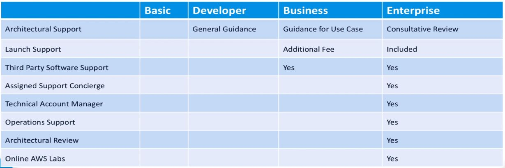

<!-- TOC depthFrom:2 depthTo:2 withLinks:1 updateOnSave:1 orderedList:0 -->

- [Compute Fundamentals](#compute-fundamentals)
- [Storage Fundamentals](#storage-fundamentals)
- [Networking Fundamentals](#networking-fundamentals)
- [Security Fundamentals](#security-fundamentals)
- [Management Fundamentals](#management-fundamentals)
- [Architecture Fundamentals](#architecture-fundamentals)
- [AWS Cost Management and Customer Support](#aws-cost-management-and-customer-support)
- [Cloud Practitioner Summary](#cloud-practitioner-summary)

<!-- /TOC -->

---

## Compute Fundamentals

**What is Compute in AWS?**

- The brains and processing power required by applications and systems to carry out computational abilities via a
series of instructions (CPU and RAM)

**Elastic Cloud Compute**

- Components include Amazon Machine Images (AMIs), instance types, the instance purchasing options, tenancy, user data,
storage options, and security.

**Elastic Load Balancing and Auto Scaling**

- ELB evenly distributes traffic to EC2 instances which helps to maintain high availability and resiliency of your
environment.

- Auto scaling is a mechanism that automatically allows you to increase or decrease your resources (EC2 Instances) to
meet demand based off of custom defined metrics and thresholds.

**Setting up an ELB**

1. Define Load Balancer
2. Assign Security Groups
3. Configure Security Settings
4. Configure Health Checks
5. Add EC2 Instances
6. Add Tags

**Auto Scaling Advantages**

1. Automatically manage resources
2. providing a better experience for users
3. reduce cost as you won't use any resources unnecessarily

**Elastic Beanstalk**

- An AWS managed service that takes your uploaded web application code and automatically provisions and deploys the
required resources within AWS to make the web application operational.

**Elastic Beanstalk Architecture**

- Applications
    - A collection of different elements, such as environments, environment configurations, and application versions
- Application Versions
    - A specific reference to a section of deployable code.
    - The application version typically point to S3.
- Environment
    - An environment refers to an application version deployed on AWS resources.
- Environment Configuration
    - A collection of parameters that dictate the resources behavior within the environment.
- Configuration Template
    - A baseline for creating a new environment configuration.

**Elastic Beanstalk Workflow**

1. Create Application
2. Upload Version
    - This creates the environment configuration.
3. Launch Environment
    - The environment is then created by Elastic Beanstalk with the appropriate resources to run your code.
4. Manage Environment
    - If the management of your application has altered the environment configuration, then your environment will be
  automatically updated.

**AWS Lambda**

*AWS Lambda* is a service that lets you run your own code in response to events in a scalable and highly
available serverless environment.

- *Severless* means that you can run your code without provisioning and managing compute resources.
- AWS will start, scale, maintain and stop the required compute resources for your lambda function.
- It is only actually *serveless* from the users perspective as they do not need to worry about how the code gets run.

**Lambda Function Elements**

1. Required resources
    - The resources required to execute your code
    - Specify the amount of RAM required
2. Maximum execution timeout
    - The maximum amount of time the lambda function will run before terminated.
3. IAM Role
    - Grants AWS Lambda the appropriate permissions
4. Handler name
    - The method in your code where the function starts its execution.

**Lambda Function Configurations Steps**

1. Select a BluePrint
    - Preconfigured Lambda Functions
2. Configure triggers
3. Configure the function
    - upload code or edit in-line
    - Define required resources, maximum execution timeout, IAM Role and Handler Name.

---

## Storage Fundamentals

**Amazon S3**

- Fully managed object based storage service: highly available, highly durable, cost effective and widely accessible.
- Almost unlimited storage capabilities
- The smallest file size supported = 0 bytes and the largest = 5 terabytes
- Data is uploaded to a specific region and duplicated across multiple AZs automatically
- Objects have a durability of 99.999999999% and an availability of 99.99%
- Objects are stored in buckets or folders within a bucket
- S3 has 3 storage classes
    - Standard
    - Standard - Infrequent Access
    - Reduced Redundancy
- Security features
    - Bucket policies
    - Access control lists
    - Data encryption
    - SSL support
- Data management features include versioning and lifecycle rules
- Often used for data backup, static websites and large datasets
- Integrates with other AWS services
- Pricing primarily based on the amount of storage used, plus request and data transfer costs

**Amazon Glacier**

- An extremely low cost, long term, durable storage solution ideally suited for long term backup and archival
requirements
- 99.999999999% durability
- Much cheaper than S3
- Does NOT provide instant access of data retrieval
- Data structure is centered around *Vaults* and *Archives*
- A *Vault* simply acts as a container for *Archives*
- An *Archive* is essentially your data stored within *Vaults*
- Unlimited *Archives* available
- The Glacier console only allows you to create *Vaults*
- You must use the Glacier web service API or the AWS SDKs to move data in/out of Glacier
- There are 3 different retrieval options: Expedited, Standard and Bulk
- Encryption is enabled by default using the AES-256 encryption algorithm
- Access control is governed through IAM, Vault access policies and Vault lock policies
- Pricing remains the same regardless of how much storage is used. however there is still request, data transfer and
data retrieval costs
- Designed to archive data for extended periods of time (Cold Storage) for a very small cost

**Elastic Block Store (EBS)**

- Provides block level storage to your EC2 instances
- Offers persistent and durable data storage
- EBS volumes can be attached and detached from instances
- Primarily used for data that is rapidly changing
- A single EBS volume can only be attached to a single EC2 instance
- Multiple EBS volumes can only be attached to a single EC2 instance
- EBS snapshots provide a point in time backup of the volume and are stored in S3
- You can create a new volume from a snapshot
- All writes are replicated multiple times within a single AZ
- EBS volumes are only available in a single AZ
- 4 types of EBS Volumes available:
    - 2 that are SSD backed:
        - General Purpose SSD (GP2)
        - Provisioned IOPS SSD (IO1)
    - 2 that are HDD backed:
        - Cold HDD (SC1)
        - Throughput Optimized HDD (ST1)
    - Cost depends on type
- Storage provisioned is billed to you on a per-second basis
- EBS snapshots also incur S3 storage costs
- EBS encrypts data both at rest and when in transit if required
- Encrypted volumes will also encrypt snapshots automatically

**Elastic File System (EFS)**

- Provides file level storage
- Fully managed, highly available and durable
- Allows you to create shared file systems
- Can meet demands by thousands of concurrent EC2 instances
- Limitless capacity
- Storage capacity grows with use
- Ideal for applications that scale across multiple instances
- EFS is a regional service
- Designed to maintain a high level of throughput (MB/s) and low latency access response
- Mount targets allow connectivity for you instances to your EFS
- Only compatible with NFS V4.0 and V4.1
- Does not support the Windows OS
- Linux instances must have the NFS Client installed for the mounting process
- EFS can run in 2 different performance mode of operations:
    - General Purpose (default)
        - Used for most cases
        - Provides the lowest latency
        - Maximum of 7000 file system operations per second for your EFS
    - Max I/O
        - Used for huge scale architectures
        - Concurrent access of 1000's of instances
        - Can exceed 7000 file system operations per second
        - Virtually unlimited amount of throughput and IOPS
        - There is however an additional latency to each I/O
- Encryption at rest is possible with KMS
- Encryption is transit is not supported
- File Sync can be used to migrate data to EFS via an agent
- Pricing is charged at per GB-months

**Amazon CloudFront**

- Amazon CloudFront is a content delivery network (CDN)
- Distributes your source web data closer to the end user via AWS edge locations as cached data
- It doesn't provide durability of data
- AWS edge locations are sites deployed across the globe to chance data and reduce latency
- Distributions control which source data it needs to distribute and to where
- Methods of data distribution:
    - Web Distribution
    - RTMP Distribution
- Distributions require origins that contain your source data, such as S3
- Data can be distributed using the following edge location options:
    - US, Canada and Europe
    - US, Canada, Europe and Asia
    - All edge locations (best performance)
- Amazon CloudFront can interact with the Web Applications Firewall service for additional security and
web application protection
- SSL certificates can be configured to be used with the distribution
- Pricing is primarily based on data transfer assets and HTTP requests

**AWS Storage Gateway**

- Allows you to provide a gateway between your own data center storage and Amazon S3/Glacier on AWS
- The storage gateway is a software appliance
- Storage Gateway offers File, Volume and Tape Gateway configurations
  - File Gateway
    - Securely store your files as objects within S3
    - Mount or map drives to an S3 bucket
    - A local on premise cache is provisioned most recently accessed files
  - Volume Gateways
    - Stored Volume Gateways
      - Used to backup local storage volumes to S3
      - Your data library also remains locally on premise
      - Presented as iSCSI volumes
    - Cached-Volume Gateways
      - Primary data storage is Amazon S3 rather than your own local storage solution
      - Utilize local data storage as a buffer and a cache
      - Presented as iSCSI volumes
- Pricing is based upon storage usage, requests and data transfer

**AWS Snowball**

- Used to securely transfer large amounts of data in and out of AWS using physical appliance, known as
a snowball
- The snowball comes as either a 50TB or 80TB storage device
- It is dust, water and tamper resistant
- Designed to allow for high speed data transfer
- All data transferred to the Snowball appliance is automatically encrypted by default
- HIPPA Compliant
- AWS most ensure the data held on the snowball appliance is deleted and removed
- Snowballs can be aggregated together
- If your data retrieval will take longer than a week consider using AWS Snowball
- Pricing is based on Amazon S3 data charges plus additional costs for the data transfer job shipping

---

## Networking Fundamentals

### Intro to the Virtual Private Cloud

**VPC - The Basics**

- The AWS Virtual Private Cloud (VPC) is a core building block for designing highly available, fault tolerant
environments.
- The VPC is a logically isolated section of the AWS Cloud dedicated to your environment.
- You have complete control over the VPC, including: IP range, subnets, routing tables and security,
  - PCs use security groups and access control lists to secure access.
  - Subnets are CIDR blocks within the IP range of your VPC (CIDR = Classless Inter-Domain Routing)
    - Essentially a block of IP numbers
- Your private CIDR block / subnet block of the AWS cloud.

**VPC Core Components**

- Subnet
  - Segment of the VPC's IP address range where you can place groups of isolated resources.
- Internet Gateway (IGW)
  - Amazon VPC side of a connection to the public internet.
- Hardware VPN Connection
  - Hardware based VPN between your Amazon VPC and your data center.
- Virtual Private Gateway (VGW)
  - Amazon VPC side of a VPN connection.  Allows connection of existing networks of a VPC.
- Customer Gateway (CGW)
  - Your side of a VPN connection.
- Router
  - Interconnect subnets and direct traffic between internet gateways, VP gateways, net gateways and subnets.
- Peering Connections
  - Enable routing of traffic via private IP addresses between two peered VPCs.

### Amazon Route 53

Route53 is a highly available *domain name service (DNS)* offered by AWS. It supports geographical *routing*
based on an end user's location.

It also provides a DNS *failover* feature which can redirect users to an alternate location if
there's an outage. It accomplishes this with health checks that monitor endpoints. Route53
makes it easy to perform a graceful application failover from a dynamic site accessible using
an elastic load balancer pointing to a static S3 base site--a common use case.

Companies can also run multi-region systems using the *location-based routing* functionality to
send users to the region closest to them. You can also use the *weighted routing* to divide
traffic to different resources based on percentages. *Latency routing* will direct users to the
lowest latency availability zone. You can use weighted routing to collect usage data or perform
blue-green deployments.

Route53 health checking and DNS failover improves the availability of applications running
behind elastic load balancers. You can run applications in multiple AWS regions and designate
alternate load balancers for failover across regions. In the event that your application is
unresponsive, Route53 will remove the unavailable load balancer endpoint from service and
direct traffic to an alternate load balancer in another region.

---

## Security Fundamentals

**Course Summary**

- **AWS Shared Security Model** - AWS manages security OF the cloud. Users are responsible for everything IN the cloud.
- **Access Management** - While AWS manages access to physical resources, access to any virtual services you run in AWS
in controlled by you.
- **IAM** - The root user is associated a unique account record, and it cannot be restricted in any way.
- **IAM Users** are persistent identities controlled via IAM.
- **IAM Groups** simplify the management of IAM users.
- **IAM Policies** are the way to define the permissions and rights that an identity can have.
- **Amazon Cloud Directory** is a highly available multi-tenant directory-based store in AWS.
- **AWS Directory Service** offers three services - Microsoft AD, Simple AD and the AD Connector.
- **Amazon Inspector** is an automated security assessment service that can be set up to run within your AWS account.
- **AWS Web Application Firewall** provides a flexible, managed service to protect your websites and applications.

**Course Summary - Best Practices**

- **Least Privilege** - Your should only grant the permissions that users need in order to complete a task and no more.
- **Enable MFA** (Multi-Factor Authentication) for your account.
- **Lock the root account down** and reduce use of the account to root specific tasks only.
- You should not use your root account for day to day admin tasks.
- You can perform any action you want by using an IAM user instead.
- **Never share your root account**, no matter what.
- **Use groups to assign permissions** instead of granting permissions directly to your IAM users.
- Enable MFA for all privileged users in your account.
- **Rotate your credentials**, not only the passwords but also the access keys.
- **Use IAM roles** whenever possible.
- **Use security groups** to restrict inbound access at the instance level.
- **Use network ACLs** to add as additional layer of security at a subnet level.
- **A Bastion host** is an instance that you place in a public subnet and give permissions to access your resources in
the private subnets.
- **It is your responsibility to manage access to your resources!**

---

## Management Fundamentals

**AWS CloudTrail**

- Records and tracks all Application Programming Interface (API) requests in your AWS Account
- Every API request captured is recoded as an 'event' within CloudTrail logs
- Events contain an array of associated metadata, for example:
    - Identity of the caller
    - Timestamp of request
    - Source IP address
- New log files are created every five minutes
- Log files are delivered and stored within S3
- CloudTrail Log files can also be delivered to CloudWatch Logs for metric monitoring and alerting via SNS
- CloudTrail is a global service supporting ALL regions
- Effective for security analysis
- Resolve day to day operational issues
- Able to track changes to your AWS infrastructure
- CloudTrail logs can be used as evidence for various compliance and governance controls

**AWS Config**

A service within the Management Tools category that can perform a number of useful functions when it comes to
resource configuration, visibility, and compliance, such as:
- Capture resource changes
- Act as resource inventory
- Store configuration history
- Provide snapshot of configurations
- Notifications about changes
- Provide AWS CloudTrail integration
- Security Analysis
- Use Rules to check compliance
- Relations connectivity information between resources

AWS Config only supports a number of different services and resource types.

Another important point is that AWS Config is configured on a region-by-region basis (detailed above). As such, you
can have different resources being monitored and recorded in each region, as you will have a different configuration
recorder.

**AWS Trusted Advisor**

- The service is a part of the Management Tools category in the AWS Management Console
- The main function is to recommend improvements to help optimize you environment based on AWS best practices
- Focuses on four categories:
    - Cost optimization
    - Performance
    - Security
    - Fault Tolerance
- There are currently 50+ different checks between the categories
- Your available checks vary based on your AWS Support Plan
- Business and Enterprise support take full advantage of ALL checks available
- All AWS accounts have access to six free core checks, these being:
    - Service Limits
    - Security Groups - Specific Ports Unrestricted
    - Amazon EBS Public Snapshots
    - Amazon RDS Public Snapshots
    - IAM Use
    - MFA on root account
- Useful features:
    - *Trusted Advisor Notifications* - Tracks your resource check changes and cost saving estimates over the course of
    a week
    - *Exclude Items* - Select specific resources to be excluded from appearing in the console within a specific check
    - *Action Links* - Action Links lead you on to remediate and issues identified
    - *Access Management* - Using IAM you can grant different levels of access to Trusted Advisor
    - *Refresh* - Perform a manual refresh five minutes after the previous refresh against either individual checks or
    against all checks

**Amazon CloudWatch**

- Provides a means of monitoring your resources via a series of metrics which are individual to each service
- Each resource sends data to you CloudWatch dashboard as metrics
- Amazon CloudWatch offers the ability of creating custom metrics for your applications
- Any data captures is retained for two weeks
- CloudWatch alarms allow you to respond to events that occur within your environment
- CloudWatch can be used as a repository for logging

**AWS Heath Dashboards**

AWS Service Dashboard
- Provides a complete health check of all services in all regions at any one time
- Allows you to view the history of service
- History kept for one year

Personal Health Dashboard
- Notifies you of any service interruptions
---

## Architecture Fundamentals

#### AWS Global Infrastructure

**Availability Zones**

- Physical data enters of AWS
- Where your resources are hosted and provisioned
- Multiple data centers can form a single availability zone
- Each AZ will always have at least one other in the same region
- AZs are linked by highly resilient, low latency private fiber optic connections
- Each AZ is isolated from all others
- The localized geographic grouping of multiple AZs is defined as an AWS Region
- Using multiple AZs within a Region allows for high availability and resiliency

**Regions**

- A collection of AZs that are geographically located close to one another
- Regions are deployed all across the globe
- Every Region will act independently of others
- They contain at least two AZs
- Using multiple regions helps compliance with regulations, laws and governance
- Utilizing multiple regions creates a high level of availability
- Not all AWS services are available in every region

**Edge Locations**

- They are deployed in highly populated areas
- Used by CloudFront to cache data and reduce latency

**Regional Edge Caches**

- Sit between your CloudFront origin servers and Edge Locations
- Contain a larger cache-width than Edge Locations
- Data is retained at Regional Edge Caches longer than Edge Locations
- Edge Locations retrieve cached data from Regional Edge Cache

#### Disaster Recovery Strategies

**RTO**: The time it takes after a disruption to restore business process to its service level.

**RPO**: The acceptable amount of data loss--measured in time.

**DR Strategies**
1. Backup and Restore
    - Data is backed up to an AWS storage service
    - Data can be imported into AWS via
        - Storage Gateway
        - AWS Snowball
        - Direct connect
        - VPN
        - Internet
    - Archives can be recovered from Amazon S3
    - Data can be restored directly to cloud resources
2. Pilot Light
    - Incorporates mirroring of data
    - The environment ca be scripted using CloudFormation
    - Resources can be scaled out and up as needed
    - Instances are launched using AMIs
    - Databases are resized as needed
3. Warm Standby
    - Incorporates mirroring of data
    - Minimal resources are ready for operation with key services
    - Resembles a smaller version of your production environment
    - The environment can be scaled up to handle peak production loads
    - DNS records are changed to redirect traffic to the standby environment
4. Multi-site
    - Effectively a complete replica of your production environment
    - Traffic is redirected to your AWS environment via Route53
    - All traffic is then supported by your AWS solution
    - This is the preferred strategy
    - Additional costs involved due to resources
    - Operates with the lowest RTO and RPO

#### Well Architected Framework

Offers a set of guidelines and questions that allow you to follow best practices.

**5 Pillars:**
1. Operational Excellence
    - Based upon running and monitoring systems to help optimize and deliver value to the business and to aid in
    supporting, improving and maintaining your processes and procedures supporting your AWS infrastructure.
2. Security
    - Defines how to manage and secure your infrastructure by protecting your data by focusing on confidentiality,
    data integrity, access management and other security controls, while ensuring risk assessment and mitigation is
    built into your solutions.
3. Reliability
    - The looks at how to maintain stability of your environment and recover from outages and failures in addition to
    automatically and dynamically meeting resourcing demands put upon your infrastructure.
4. Performance Efficiency
    - This pillar is dedicated on ensuring you have the correctly specified resources to efficiently meet the demands of
    your customers by monitoring performance and adapting your infrastructure as requirements change based on workloads.
5. Cost Optimization
    - This pillar is used to help you reduce your cloud costs by understanding where it's possible to optimize your
    spend through a variety of means.

---

## AWS Cost Management and Customer Support

**Cost Management**

| Tool/Service | Purpose | Use Case |
|--------------|---------|----------|
|TCO Calculator | - Compare on-premise and AWS costs | - Plan for AWS migration/usage |
|Billing Dashboard | - Graphs of previous /current month costs and usage | - Quick view of recent account activity |
|Cost Explorer | - Numerous at-a-glance graphs  - Historical data for last 12 months  - Forecast spending for up to 3 months  - Reserved Instance Recommendations | - Quickly identify long-term trends  - Predict future costs  - Save with Reserved Instances |
|Cost and Usage Report | - Detailed data on previous 12 months cost and usage | - Investigate long-term trends |
|AWS Budgets | - Set budgets for cost, usage, or reserved instance utilization | - Anyone needing to monitor cost, usage, or RI cost-savings |
|Consolidated Billing | - Merge separate accounts into one bill  - Potential savings based on volume | - Companies with multiple AWS accounts  - Qualify for high-volume discounts |

**Customer Support**

---

## Cloud Practitioner Summary

**Certification knowledge requirements**

1. Cloud Concepts
    - Define the AWS Cloud and its value proposition
    - Identify aspects of AWS Cloud economics
    - List the different cloud architecture design principles

2. Security
    - Define the AWS Shared Responsibility model
    - Define AWS Cloud Security and compliance concepts
    - Identify AWS access management capabilities
    - Identify resources for security support

3. Technology
    - Define methods of deploying and operating in the AWS Cloud
    - Define the AWS global infrastructure
    - Identify the core AWS services
    - Identify resources for technology support

4. Billing and Pricing
    - Compare and contrast the various pricing models for AWS
    - Recognize the various account structures in relation to AWS billing and pricing
    - Identify resources available for billing support

[Exam Guide](https://aws.amazon.com/certification/certified-cloud-practitioner/)

Other Material:
- [Overview of Amazon Web Services](https://d1.awsstatic.com/whitepapers/aws-overview.pdf)
- [Architecting for the Cloud: AWS Best Practices](https://d1.awsstatic.com/whitepapers/AWS_Cloud_Best_Practices.pdf)
- [How AWS Pricing Works](https://d1.awsstatic.com/whitepapers/aws_pricing_overview.pdf)
- [The Total Cost of (Non) Ownership of Web Applications in the Cloud](https://media.amazonwebservices.com/AWS_TCO_Web_Applications.pdf)
- [Compare AWS Support Plans](https://aws.amazon.com/premiumsupport/plans/)

[All Whitepapers](https://aws.amazon.com/whitepapers/)

**Courses**

1. What is Cloud Computing?
    - Cloud computing definition
    - Cloud computing benefits and key concepts
    - When and when cloud computing should be used and which models to implement

2. Compute Fundamentals
    - Compute services and basic functions
    - Compute services basic components and features
    - How Compute services can be used with auto scaling and load balancing

3. Storage Fundamentals
    - Storage services and their differences
    - Storage services basic components and features
    - Storage services use cases
    - How each storage service utilizes cloud computing benefits, such as scalability and elasticity

4. Database Fundamentals
    - Managed database solutions
    - RDS basic structure and function
    - High availability configurations of RDS
    - DynamoDB
    - Aurora

5. Networking Fundamentals
    - Networking services basic functions and features
    - VPC basic components and features

6. Security Fundamentals
    - Security services and use cases
    - Security services basic components and features
    - How each service offers a layer of security
    - Shared Responsibility Model summary
    - Apply Shared Responsibility Model to different components of the cloud

7. Management Fundamentals
    - Management services primary functions
    - Management services basic components and features
    - Role each service plays to maintain and operate an application

8. Architecture Fundamentals
    - Components of AWS global infrastructure and their impact on AWS solutions
    - Five pillars of the AWS Well-Architected Framework
    - Standard disaster recovery methods and how a business would select a method

9. Cost Management and Customer Support
    - Cost management services and support plans
    - Cost management services and support plans unique features and benefits
    - Cost management services and support plans use cases

---
